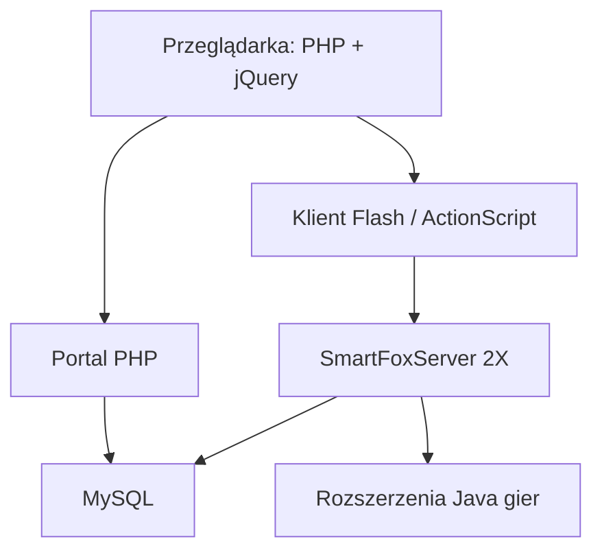
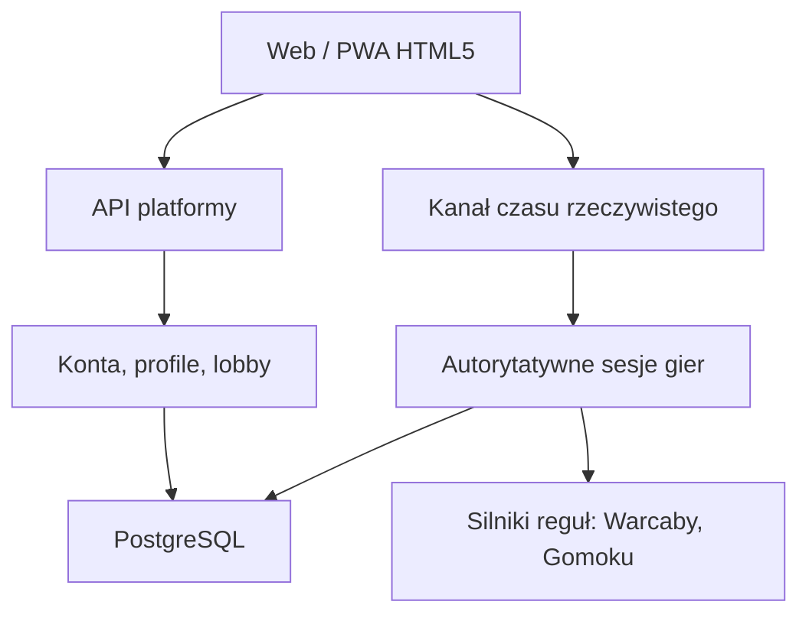

# Audyt techniczny platformy Gracz.pl

**Wersja raportu:** 1.0  
**Data audytu:** 21 sierpnia 2026 r.  
**Repozytorium:** `developergracz/gracz-pl-2`  
**Zakres bazowy:** gałąź `main`, commit `6accdab509126edfa8b1db06f7fd0e13757a5124`  
**Właściciel projektu:** Czesław Socha  
**Klasyfikacja:** dokument wewnętrzny projektu

---

## 1. Streszczenie zarządcze

Gracz.pl jest kompletnym, historycznym systemem internetowej platformy gier,
a nie jedynie zbiorem makiet. Repozytorium zawiera portal społecznościowy w PHP,
obsługę kont, profili, znajomych, rankingów, administracji i reklam oraz dwie gry
multiplayer: Warcaby i Gomoku. Gry korzystają z klientów Adobe Flash/ActionScript
oraz serwerowych rozszerzeń Java dla SmartFoxServer 2X.

Najważniejszym atutem projektu jest zachowana wiedza domenowa: zasady gier,
przepływy lobby, mechanizmy pokojów, rankingów, zaproszeń, obserwatorów,
remisów, cofania ruchów i administracji. Kod stanowi wartościową specyfikację
zachowania dawnego serwisu i może być podstawą odbudowy Gracz.pl.

Systemu w obecnym stanie **nie należy jednak uruchamiać publicznie**. Główne
przyczyny to niewspierany Flash, przestarzały mechanizm haseł SHA-1, możliwość
przekazania identyfikatora sesji przez żądanie POST, logowanie pełnych danych
żądań, stare biblioteki oraz brak skutecznych testów i procesu aktualizacji
zależności. Repozytorium zawiera też logi, kopie i pliki operacyjne, które nie
powinny znajdować się w historii kodu.

Rekomendowana strategia to **kontrolowana modernizacja modułowa**, a nie próba
bezpośredniego uruchomienia starego stosu ani jednorazowe przepisanie całego
systemu. Pierwszym pionowym modułem powinny pozostać Warcaby: nowy silnik reguł,
serwer autorytatywny, logowanie, lobby i klient HTML5. Taki fundament został już
rozpoczęty na gałęzi `feature/checkers-engine-foundation`.

### Ocena ogólna

| Obszar | Ocena | Wniosek |
|---|---:|---|
| Wartość biznesowa i domenowa | 4/5 | Zachowano rozbudowane funkcje portalu i dwóch gier |
| Możliwość uruchomienia historycznego | 2/5 | Brakuje kompletnej, powtarzalnej konfiguracji i schematu bazy |
| Bezpieczeństwo obecnego kodu | 1/5 | Kilka ryzyk krytycznych i wysokich |
| Utrzymywalność | 1/5 | Monolityczny PHP, stare zależności, pliki binarne i kopie |
| Testowalność | 1/5 | Brak testów starego systemu i nieskuteczne CI |
| Potencjał modernizacji | 4/5 | Dobra baza funkcjonalna i zachowany kod serwera gier |

**Decyzja audytowa:** zachować stare repozytorium jako materiał referencyjny,
odizolować je od produkcji i kontynuować budowę nowej platformy modułami.

---

## 2. Cel i zakres audytu

Audyt miał odpowiedzieć na następujące pytania:

1. Co faktycznie znajduje się w repozytorium i które elementy są wartościowe?
2. Czy dawny serwis można bezpiecznie uruchomić w Internecie?
3. Jakie są najważniejsze ryzyka techniczne, bezpieczeństwa i utrzymania?
4. Które elementy należy zachować, przepisać albo wycofać?
5. W jakiej kolejności odbudować Gracz.pl jako nowoczesny serwis na 10–15 lat?

Zakres objął:

- strukturę repozytorium i historię artefaktów,
- portal PHP i jego funkcje użytkownika oraz administracji,
- autoryzację, sesje, reset haseł i integrację z Facebookiem,
- klienty Flash/ActionScript,
- rozszerzenia Java/SmartFoxServer dla Warcabów, Gomoku i strefy Gracz,
- konfigurację sieciową klientów gier,
- biblioteki frontendowe i zależności,
- automatyzację CI/CD, testy, obserwowalność i dokumentację,
- ryzyka prawne i operacyjne widoczne w kodzie,
- docelową architekturę i plan migracji.

### Poza zakresem

Nie wykonano aktywnych testów penetracyjnych działającej domeny ani serwera,
ponieważ audyt dotyczył kodu repozytorium. Nie przeprowadzono pełnej dekompilacji
plików SWF/JAR ani analizy bazy produkcyjnej. Repozytorium nie zawiera kompletnego
schematu SQL i danych migracyjnych, więc zgodność struktury bazy oceniono tylko
na podstawie zapytań w kodzie.

---

## 3. Metodyka

Zastosowano statyczny przegląd techniczny z elementami podejścia OWASP i audytu
gotowości modernizacyjnej:

- inwentaryzacja plików, formatów i rozmiarów,
- identyfikacja granic modułów i przepływów danych,
- przegląd krytycznych ścieżek logowania, sesji, administracji i ruchów gry,
- wyszukiwanie przestarzałych algorytmów i zależności,
- ocena konfiguracji sieciowej i przechowywania danych,
- ocena powtarzalności budowy, testowania i wdrożenia,
- klasyfikacja ryzyka: krytyczne, wysokie, średnie i niskie,
- przygotowanie planu działań według priorytetu i zależności.

Ocena opisuje stan wskazanego commitu. Każde wdrożenie powinno zostać poprzedzone
ponowną kontrolą bezpieczeństwa aktualnej wersji.

---

## 4. Inwentaryzacja repozytorium

### 4.1. Struktura główna

| Obszar | Zawartość | Liczba plików | Przybliżony rozmiar |
|---|---|---:|---:|
| `website` | portal PHP, frontend, grafiki, biblioteki, logi, gry do publikacji | 610 | 64,4 MB |
| `games-dev` | źródła i artefakty Warcabów, Gomoku oraz GraczZoneExtension | 313 | 84,5 MB |
| `.github` | dwa historyczne workflow GitHub Actions | 2+ | pomijalny |
| **Razem starego systemu** | kod i zasoby historyczne | **923** | **ok. 149 MB** |

Nowy moduł `modern/checkers-engine`, dodany później na gałęzi funkcjonalnej, nie
wchodzi do powyższej statystyki stanu `main`.

### 4.2. Technologie

| Warstwa | Technologia historyczna | Stan |
|---|---|---|
| Portal | PHP proceduralny + PDO/MySQL | Kod z ok. 2013 r., wymaga migracji |
| Frontend portalu | HTML, CSS, jQuery 1.9.1, jQuery UI 1.10.x | Przestarzałe i niedostosowane do współczesnych urządzeń |
| Klient gier | Adobe Flash, ActionScript 3, SWF/FLA | Technologia zakończona i blokowana przez przeglądarki |
| Multiplayer | SmartFoxServer 2X, Java extensions | Zachowana logika, zależność komercyjna/legacy |
| Integracja społecznościowa | stary Facebook PHP SDK | Wymaga całkowitej aktualizacji lub usunięcia |
| Baza danych | MySQL przez PDO i SmartFox DBManager | Brak wersjonowanego schematu/migracji |
| Operacje | Jenkins, Docker, OpenVPN, Portainer, Nginx, PHP-FPM, Nagios | Opisane w README, konfiguracje nie są kompletne w repo |

### 4.3. Funkcje biznesowe zachowane w kodzie

- rejestracja, aktywacja konta, logowanie i reset hasła,
- profile, ustawienia prywatności, znajomi i czarna lista,
- rozmowy, zaproszenia, zgłaszanie błędów i nadużyć,
- rankingi, statystyki, historia rozgrywek i użytkownicy online,
- panel administracyjny, blokowanie kont/IP, mailing i reklamy,
- pokoje gier, gracze i obserwatorzy,
- Warcaby oraz Gomoku multiplayer,
- propozycja remisu, cofnięcia ruchu, restartu i ustawień pokoju,
- połączenie sesji portalu PHP z tożsamością SmartFoxServer.

### 4.4. Elementy o wysokiej wartości do zachowania

1. Reguły i przepływy Warcabów oraz Gomoku w kodzie Java/ActionScript.
2. Model pokojów, obserwatorów, zaproszeń i stanów rozgrywki.
3. Założenia rankingów i historii wyników.
4. Materiały graficzne i identyfikacja marki, po weryfikacji praw do każdego
   zasobu.
5. Regulaminy i polityki jako materiał historyczny do ponownej redakcji prawnej.
6. Opis infrastruktury w README jako zapis dawnych decyzji operacyjnych.

---

## 5. Obecna architektura

Historyczny system tworzy silnie sprzężony układ:

Portal zapisuje identyfikator sesji PHP w bazie. Klient przekazuje ten
identyfikator do SmartFoxServer, a rozszerzenie `OnLoginEventHandler` wyszukuje
użytkownika po `session_id`. Rozwiązanie integrowało oba systemy, lecz rozszerza
zaufanie do sekretu sesyjnego na klienta, bazę i osobny serwer czasu rzeczywistego.

Kod portalu jest w większości proceduralny. Duże pliki `library_main.php`
(ok. 160 KB) i `library_games.php` (ok. 66 KB) skupiają wiele niezależnych
odpowiedzialności: dostęp do danych, bezpieczeństwo, konta, pliki, pocztę,
renderowanie oraz operacje administracyjne. Utrudnia to testowanie i bezpieczne
zmiany.

---

## 6. Rejestr ustaleń i ryzyk

### Skala

- **Krytyczne (C):** możliwość przejęcia kont/danych albo całkowity brak
  możliwości bezpiecznego uruchomienia.
- **Wysokie (H):** poważne ryzyko naruszenia, awarii lub kosztownego utrzymania.
- **Średnie (M):** istotny problem jakości, zgodności lub niezawodności.
- **Niskie (L):** dług techniczny i usprawnienia porządkowe.

### 6.1. Podsumowanie ustaleń

| ID | Poziom | Ustalenie | Zalecenie |
|---|---|---|---|
| C-01 | Krytyczne | Hasła użytkowników skracane SHA-1 z globalnym ziarnem | Migracja do Argon2id/scrypt z indywidualną solą |
| C-02 | Krytyczne | Klient może przekazać `PHPSESSID` w POST | Usunąć; rotować i unieważnić stare sesje |
| C-03 | Krytyczne | Pełne `REQUEST` trafia do logów błędów | Natychmiast wyłączyć i oczyścić historię/logi |
| C-04 | Krytyczne | Flash jest niewspierany i nie działa w nowoczesnych przeglądarkach | Nowy klient HTML5; SWF tylko jako archiwum |
| H-01 | Wysokie | Sesja PHP pełni rolę poświadczenia SmartFox | Krótkotrwały, podpisany token jednorazowy/OIDC |
| H-02 | Wysokie | Cookie sesji ma `Secure=false`; brak jawnego SameSite | Wymusić HTTPS, Secure, HttpOnly i SameSite |
| H-03 | Wysokie | Publiczna konfiguracja ma stały IP, porty i `debug=true` | Konfiguracja środowiskowa, TLS, debug off |
| H-04 | Wysokie | Logi PHP i dzienne są w repozytorium | Usunąć z Git, rotować dane, dodać reguły ignorowania |
| H-05 | Wysokie | `.htpasswd`, kopie i archiwa są wersjonowane | Usunąć, wymienić poświadczenia, skan sekretów |
| H-06 | Wysokie | Stare biblioteki bez kontrolowanego procesu aktualizacji | Współczesny menedżer zależności i SCA |
| H-07 | Wysokie | Brak schematu bazy i migracji | Odtworzyć model, wprowadzić migracje i backup/restore test |
| H-08 | Wysokie | Brak testów starego systemu | Testy charakterystyki, jednostkowe, integracyjne i E2E |
| M-01 | Średnie | Monolityczne biblioteki proceduralne | Podział na moduły domenowe i warstwy |
| M-02 | Średnie | Nierówna walidacja i kodowanie danych wejścia/wyjścia | Walidacja po stronie serwera i jednolite kodowanie |
| M-03 | Średnie | Zmiany stanu wykonywane częściowo przez GET | POST/PUT/DELETE + CSRF i kontrola uprawnień |
| M-04 | Średnie | Reset hasła generuje i wysyła nowe hasło e-mailem | Jednorazowy token resetu, bez wysyłania hasła |
| M-05 | Średnie | CI wskazuje `master`, repo używa `main` | Nowe workflow dla właściwej gałęzi |
| M-06 | Średnie | Workflow wymaga nieobecnych plików Composer | Naprawić lub usunąć nieprawdziwy pipeline |
| M-07 | Średnie | Brak odtwarzalnej infrastruktury | IaC, kontenery, konfiguracja i runbook |
| M-08 | Średnie | Panele SmartFox/phpMyAdmin/Nagios po HTTP | Prywatna sieć, SSO/MFA, TLS, brak publicznego dostępu |
| M-09 | Średnie | Kod i skompilowane artefakty są wymieszane | Oddzielić źródła, buildy, wydania i archiwum |
| M-10 | Średnie | Nieaktualne dokumenty prawne i mechanizm zgód | Audyt RODO/cookies/regulaminu przed startem |
| L-01 | Niskie | Duplikaty, `.add`, `.bak`, `.copy`, RAR, stare projekty IDE | Archiwizacja i oczyszczenie drzewa roboczego |
| L-02 | Niskie | Niespójne nazwy, komentarze i martwy kod | Standard kodowania, lint i sukcesywne porządki |

---

## 7. Szczegółowa analiza bezpieczeństwa

### C-01 — przechowywanie haseł przy użyciu SHA-1

Funkcja logowania wylicza `sha1($seed_private.$param_password)`. SHA-1 jest
algorytmem szybkim, zaprojektowanym do integralności, nie do przechowywania
haseł. Globalne ziarno nie zastępuje indywidualnej soli. Ujawnienie bazy i ziarna
umożliwi szybkie próby słownikowe wobec wszystkich kont.

**Działania:**

1. Nie przenosić hashy SHA-1 jako mechanizmu docelowego.
2. Nowe konta zapisywać przez Argon2id lub scrypt.
3. Dla dawnych kont zastosować migrację po poprawnym logowaniu lub wymuszony
   reset hasła.
4. Wprowadzić minimalną długość, listę skompromitowanych haseł, ograniczanie prób
   i MFA dla administratorów.

### C-02 — możliwość ustawienia identyfikatora sesji z żądania

Kod startowy wywołuje `session_id($_POST['PHPSESSID'])`, jeżeli pole występuje.
Pozwala to klientowi wpływać na identyfikator sesji przed `session_start()` i
zwiększa ryzyko utrwalenia lub przejęcia sesji.

**Działania:** usunąć tę ścieżkę, unieważnić istniejące sesje, regenerować ID po
zmianie poziomu uprawnień i nigdy nie przesyłać identyfikatora sesji w treści
formularza lub URL.

### C-03 — logowanie całej zawartości żądania

`savePHPError()` zapisuje `print_r($_REQUEST, true)` wraz z URL-em i adresem IP.
Żądanie może zawierać hasła, tokeny, kody aktywacyjne i dane osobowe. Co więcej,
pliki `php_errors.log`, `php_exceptions.log` i `log_daily.log` znajdują się w
repozytorium.

**Działania:** zatrzymać logowanie danych uwierzytelniających, zdefiniować listę
dozwolonych pól, maskować sekrety, ograniczyć retencję i dostęp, sprawdzić czy
historyczne dane wymagają obsługi incydentu i rotacji poświadczeń.

### C-04 — Adobe Flash

Flash zakończył cykl życia i jest blokowany przez współczesne przeglądarki.
Pliki SWF/FLA nie zapewniają dostępności mobilnej, aktualizacji bezpieczeństwa
ani stabilnej dystrybucji.

**Działania:** zachować FLA/SWF/ActionScript wyłącznie jako źródło wiedzy i
materiał archiwalny. Klienta napisać ponownie w HTML5/Canvas lub DOM, z
responsywnym sterowaniem dotykowym.

### H-01 — przekazywanie sesji PHP do SmartFoxServer

`OnLoginEventHandler` traktuje login klienta jako identyfikator `PHPSESSID`,
wyszukuje rekord po `session_id` i zapisuje dane użytkownika w sesji SmartFox.
Kod diagnostyczny wypisuje identyfikator sesji. Przejęcie tego identyfikatora
może pozwolić podszyć się pod gracza.

**Działania:** portal powinien wydawać krótkotrwały, podpisany token przeznaczony
wyłącznie do wejścia do konkretnej gry/pokoju. Serwer gry weryfikuje podpis,
audience, czas ważności i jednorazowy identyfikator. Nie wolno logować tokenu.

### H-02 — ustawienia cookie

Wywołanie `session_set_cookie_params(..., false, true)` ustawia HttpOnly, lecz
pozostawia `Secure=false`; nie ma jawnego SameSite. Jest to niewystarczające dla
publicznego serwisu.

**Działania:** wyłącznie HTTPS, `Secure=true`, `HttpOnly=true`, `SameSite=Lax`
lub `Strict`, krótki czas sesji, rotacja po zalogowaniu oraz unieważnianie po
wylogowaniu i zmianie hasła.

### H-03 — jawna konfiguracja sieciowa i tryb debug

Pliki konfiguracyjne Warcabów i Gomoku zawierają stały adres `164.132.59.104`,
port `9933`, HTTP `8080`, BlueBox i `<debug>true</debug>`. Konfiguracja łączy kod
z dawną infrastrukturą i może ujawniać informacje diagnostyczne.

**Działania:** nie reaktywować tych punktów bez odrębnej oceny. Używać nazw DNS,
TLS/WSS, zmiennych środowiskowych i wyłączonego debugowania.

### Pozostałe problemy bezpieczeństwa

- token CSRF jest porównywany zwykłym `==`; nowy system powinien używać
  sprawdzonego frameworka i porównania stałoczasowego,
- część operacji administracyjnych zmienia stan przez parametry GET,
- formularz rejestracyjny wymaga historycznie tylko 6 znaków hasła,
- reset hasła generuje nowe hasło i wysyła je pocztą, zamiast wysłać
  jednorazowy link,
- panel administracyjny wskazuje bezpośrednio SmartFox Admin, phpMyAdmin i Nagios,
- stary Facebook SDK oraz liczne biblioteki frontendowe mogą zawierać znane
  podatności,
- repozytorium zawiera `.htpasswd`, logi, kopie `.bak`, archiwa `.rar` i
  skompilowane artefakty; wszystkie wymagają przeglądu i oczyszczenia historii.

---

## 8. Jakość kodu i utrzymywalność

### Mocne strony

- przygotowane zapytania PDO występują w istotnych ścieżkach,
- po logowaniu następuje regeneracja sesji,
- istnieje historyczny token przeciw CSRF,
- serwerowa logika gier została zachowana w kodzie Java,
- rozwiązanie obejmuje pełne przepływy produktu, nie tylko samą planszę,
- rozdzielono historycznie strefy Checkers, Gomoku i Gracz.

### Słabe strony

- globalne zmienne i funkcje utrudniają izolowane testy,
- duże biblioteki łączą dostęp do danych, domenę, HTML, pocztę i bezpieczeństwo,
- martwy oraz zakomentowany kod komplikuje analizę,
- nazewnictwo i współrzędne planszy są miejscami niespójne,
- źródła, klasy skompilowane, JAR-y i biblioteki serwerowe są przechowywane
  razem,
- wiele kopii plików nie ma jednoznacznego statusu (`.copy`, `.add`, datowane
  wersje, `.bak`),
- brak deklaracji wspieranej wersji PHP, Javy, MySQL i SmartFoxServer,
- brak automatycznej kontroli formatowania, statycznej analizy i pokrycia testami.

### Wniosek

Naprawianie starego monolitu do standardu produkcyjnego byłoby kosztowne i
ryzykowne. Należy wydobywać zachowanie domenowe, zapisywać je w testach nowego
systemu i zastępować moduły pionowymi fragmentami funkcjonalności.

---

## 9. Gry i multiplayer

### 9.1. Warcaby

Kod zawiera planszę 8×8, po 12 pionków, damki, ruchy, bicia, cofanie ruchu,
propozycję remisu, ponowną grę, gotowość graczy, obserwatorów i zakończenie gry.
To cenna specyfikacja, jednak widoczne są pozostałości prób i zakomentowanych
wariantów reguł. Przed produkcją trzeba jednoznacznie opisać wariant warcabów i
pokryć reguły testami.

### 9.2. Gomoku

Gomoku ma analogiczny zestaw rozszerzeń SmartFoxServer i przepływów pokoju.
Duplikacja między modułami wskazuje, że nowa platforma powinna mieć wspólny
framework sesji gry, a jedynie reguły planszy powinny być wymienne.

### 9.3. Model autorytatywnego serwera

Nowy serwer musi być jedynym źródłem prawdy. Klient wysyła zamiar ruchu, a serwer:

1. identyfikuje gracza i jego kolor,
2. sprawdza kolejność tury,
3. waliduje ruch względem pełnego stanu,
4. aktualizuje stan atomowo,
5. zapisuje zdarzenie,
6. publikuje nową migawkę obu klientom,
7. odrzuca duplikaty przez identyfikator żądania.

Takie podejście ogranicza oszustwa i umożliwia reconnect, obserwację oraz
deterministyczne odtwarzanie partii.

---

## 10. Baza danych i dane

Repozytorium odwołuje się m.in. do użytkowników, gier, rozgrywek, wyników,
rankingów, znajomych, czarnej listy, wiadomości, zaproszeń, reklam i zgłoszeń.
Nie znaleziono kompletnego, wersjonowanego schematu SQL ani migracji.

### Ryzyka

- nie da się powtarzalnie utworzyć środowiska od zera,
- nie wiadomo, które ograniczenia integralności istnieją w bazie,
- widoki rankingowe są wymagane przez PHP i SmartFox,
- migracja kont wymaga bezpiecznej obsługi dawnych hashy,
- stare logi i profile mogą podlegać obowiązkom RODO.

### Zalecany model docelowy

- PostgreSQL jako główna baza transakcyjna,
- wersjonowane migracje uruchamiane w CI/CD,
- tabele: użytkownicy, poświadczenia, sesje, profile, relacje, pokoje, partie,
  uczestnicy, zdarzenia ruchów, rankingi, moderacja i audyt,
- Redis tylko dla krótkotrwałego stanu, limitów i pub/sub, nie jako jedyne źródło
  historii partii,
- szyfrowane kopie zapasowe i regularny test odtworzenia,
- minimalizacja danych osobowych i jawna polityka retencji.

---

## 11. Frontend, UX i dostępność

Historyczny portal opiera się na starym jQuery, jQuery UI, Metro UI i Flashu.
Nie spełnia oczekiwań współczesnych urządzeń mobilnych ani standardu dostępności.

Nowy interfejs powinien zapewnić:

- układ mobile-first i pełne sterowanie dotykowe,
- działanie bez wtyczek w aktualnych Chrome, Edge, Firefox i Safari,
- semantyczny HTML i obsługę klawiatury,
- czytelne komunikaty stanu i błędów,
- kontrast zgodny co najmniej z WCAG 2.2 AA,
- rozdzielenie lobby, profilu i widoku partii,
- brak zaufania do walidacji wykonywanej w przeglądarce,
- możliwość instalacji jako PWA dopiero po ustabilizowaniu podstawowej wersji.

---

## 12. CI/CD, testy i operacje

### Stan zastany

Workflow `php.yml` nasłuchuje gałęzi `master`, podczas gdy repozytorium używa
`main`. Próbuje wykonać `composer validate` i `composer install`, lecz w
audytowanym drzewie nie ma kompletnego `composer.json`/`composer.lock`. Test suite
jest jedynie komentarzem. Użyte akcje `checkout@v2` i `cache@v2` są stare.

README opisuje Jenkins, GitFlow, VPN, Docker, Portainer, Nginx, PHP-FPM i Nagios,
ale repozytorium nie zawiera kompletnego, odtwarzalnego środowiska.

### Docelowe bramki jakości

Każdy Pull Request powinien przejść:

1. formatowanie i lint,
2. testy jednostkowe reguł,
3. testy integracyjne API i bazy,
4. test E2E dwóch klientów,
5. statyczną analizę bezpieczeństwa,
6. skan zależności i sekretów,
7. budowę kontenera,
8. opcjonalny skan obrazu,
9. wdrożenie testowe dopiero po zatwierdzeniu.

Produkcja powinna mieć healthcheck, metryki, scentralizowane logi bez sekretów,
alerty, limity zasobów, procedurę rollbacku i instrukcję reagowania na incydenty.

---

## 13. Aspekty prawne i zgodność

Kod zawiera politykę prywatności, cookies i regulamin, ale są to dokumenty
historyczne. Przed publicznym uruchomieniem wymagają oceny prawnika pod kątem:

- RODO: podstawy przetwarzania, retencja, prawa użytkownika, proces usunięcia,
- cookies i analityka: mechanizm zgód oraz rejestr dostawców,
- danych dzieci i minimalnego wieku użytkownika,
- moderacji, zgłoszeń i treści użytkowników,
- regulaminu turniejów, nagród, reklam i planowanych mechanizmów monetyzacji,
- kwalifikacji mechanik losowych/nagród w świetle przepisów hazardowych,
- praw do grafik, dźwięków, bibliotek oraz kodu dostawców trzecich.

Ten raport nie jest opinią prawną.

---

## 14. Rekomendowana architektura docelowa

### Zasady architektoniczne

- modułowy monolit na start, bez przedwczesnych mikrousług,
- jeden system tożsamości i autoryzacji,
- oddzielone silniki reguł bez zależności od UI i transportu,
- wersjonowany kontrakt komunikatów,
- autorytatywny serwer gry,
- zdarzeniowy zapis ruchów i odtwarzalne migawki,
- adaptery magazynów danych, aby testy nie wymagały infrastruktury,
- kontenery i konfiguracja przez zmienne środowiskowe/menedżer sekretów,
- obserwowalność i bezpieczeństwo od pierwszego wdrożenia.

### Proponowany stos

Obecny prototyp wykorzystuje Node.js i czysty HTML5. Jest to rozsądny wybór dla
pierwszego pionowego modułu. Docelowo można użyć:

- TypeScript/Node.js dla API i czasu rzeczywistego,
- React/Next.js albo lekki frontend TypeScript po potwierdzeniu potrzeb portalu,
- PostgreSQL i Redis,
- WebSocket/SSE zależnie od charakteru komunikatu,
- Docker oraz zarządzany hosting testowy,
- GitHub Actions i automatyczne wdrożenia po zatwierdzeniu.

Wybór frameworka nie jest ważniejszy od granic domenowych, testów i bezpiecznej
migracji danych.

---

## 15. Plan modernizacji

### Etap 0 — zabezpieczenie materiału (natychmiast)

- oznaczyć stary kod jako archiwalny i nieprodukcyjny,
- usunąć logi, `.htpasswd`, kopie oraz potencjalne sekrety z bieżącego drzewa,
- wymienić wszystkie poświadczenia, które kiedykolwiek mogły trafić do Git,
- wykonać kopię repozytorium i danych poza środowiskiem produkcyjnym,
- wyłączyć nieużywane dawne porty/usługi i zweryfikować historyczny adres IP,
- sporządzić spis praw do kodu i zasobów.

**Kryterium zakończenia:** brak starego systemu wystawionego publicznie i brak
aktywnych sekretów w repozytorium.

### Etap 1 — Warcaby jako pionowy moduł MVP

- ustalić i zapisać wariant reguł,
- czysty, deterministyczny silnik z testami,
- serwerowa sesja dwóch graczy,
- rejestracja/logowanie i podstawowe lobby,
- klient HTML5 mobilny,
- reconnect i trwały zapis partii,
- test dwóch przeglądarek i CI.

**Kryterium zakończenia:** dwie osoby mogą bezpiecznie utworzyć konta, wejść do
pokoju i ukończyć partię w aktualnych przeglądarkach.

### Etap 2 — fundament platformy

- PostgreSQL i migracje,
- odnowione konta/profile, reset hasła i sesje,
- wspólny model pokojów, zaproszeń i obserwatorów,
- moderacja, zgłoszenia, limity i audyt operacji,
- monitoring, backupy i środowisko testowe,
- przegląd RODO i dokumentów prawnych.

### Etap 3 — ranking i społeczność

- ranking sezonowy i historia wyników,
- znajomi, blokowanie, prywatność i powiadomienia,
- odporność na rozłączenia, nadużycia i boty,
- panel administracyjny z MFA i śladem audytowym.

### Etap 4 — Gomoku i kolejne gry

- wykorzystać wspólny framework sesji,
- przenieść wyłącznie silnik zasad Gomoku,
- wspólne lobby, ranking, konta i moderacja,
- testy regresji dla każdej gry.

### Etap 5 — skalowanie i monetyzacja

- pomiary realnego obciążenia przed skalowaniem,
- reklamy i płatności dopiero po zgodności prawnej i bezpieczeństwie,
- turnieje/nagrody po odrębnej analizie regulacyjnej,
- CDN, autoscaling i podział usług tylko wtedy, gdy uzasadnią to dane.

---

## 16. Priorytety działań

### Pierwsze 7 dni

1. Nie uruchamiać publicznie starego PHP/Flash/SmartFox.
2. Usunąć lub zarchiwizować logi i pliki poświadczeń.
3. Rotować dawne sekrety i zamknąć stare usługi sieciowe.
4. Zatwierdzić wariant reguł Warcabów.
5. Utrzymać nowy kod wyłącznie na gałęzi funkcjonalnej z PR i CI.

### Pierwsze 30 dni

1. Dokończyć pionowy prototyp Warcabów.
2. Uruchomić prywatne środowisko testowe.
3. Zaprojektować bazę PostgreSQL i migrację kont.
4. Dodać skany sekretów i zależności do CI.
5. Opracować diagram danych i kontrakty API.
6. Przygotować rejestr danych osobowych i zasobów licencyjnych.

### 30–90 dni

1. Pilotaż z małą grupą testerów.
2. Testy bezpieczeństwa i obciążenia.
3. Backup/restore i procedury operacyjne.
4. Ranking, profile i moderacja.
5. Decyzja o migracji Gomoku na podstawie jakości fundamentu.

---

## 17. Kryteria gotowości do publicznego testu

Publiczny test może rozpocząć się dopiero, gdy:

- wszystkie ustalenia krytyczne zostaną zamknięte,
- cały ruch działa przez HTTPS/WSS,
- sekrety nie znajdują się w kodzie ani logach,
- hasła są chronione Argon2id/scrypt,
- istnieją limity logowania i podstawowa ochrona przed nadużyciami,
- serwer waliduje każdy ruch,
- testy jednostkowe, integracyjne i E2E przechodzą w CI,
- istnieje backup i potwierdzony proces odtworzenia,
- monitoring wykrywa awarię i anomalie,
- regulamin, prywatność i cookies są aktualne,
- administratorzy używają MFA,
- istnieje możliwość szybkiego wyłączenia wdrożenia i rollbacku.

---

## 18. Stan modernizacji na dzień raportu

Na gałęzi `feature/checkers-engine-foundation` powstał nowy moduł
`modern/checkers-engine`, obejmujący:

- deterministyczny silnik Warcabów 8×8,
- obowiązkowe i wielokrotne bicie, promocję oraz remisy,
- autorytatywną sesję serwerową i idempotentne ruchy,
- HTTP API, SSE, reconnect oraz zapis zdarzeń,
- konta z scrypt, podpisane sesje i limitowanie logowania,
- lobby i responsywny klient HTML5,
- 36 testów modułowych/integracyjnych,
- test pełnej ścieżki w Chromium,
- GitHub Actions zakończone sukcesem,
- punkt startowy, healthcheck i przygotowanie Docker Compose.

Jest to zgodne z rekomendacją audytu dotyczącą pionowej modernizacji. Moduł nadal
jest prototypem i nie zastępuje wymagań przedprodukcyjnych, zwłaszcza relacyjnej
bazy, TLS, zarządzania sekretami, obserwowalności i testu bezpieczeństwa.

---

## 19. Wnioski końcowe

Projekt Gracz.pl ma realną wartość: zawiera kompletne pomysły produktowe,
historyczne procesy portalu i kod dwóch gier multiplayer. Nie jest jednak
bezpiecznym kandydatem do prostego „włączenia” na serwerze. Największym błędem
byłaby próba reaktywacji starego stosu bez izolacji i przebudowy zabezpieczeń.

Najlepsza droga to:

1. zachować stary kod jako dokumentację zachowania,
2. zabezpieczyć repozytorium i usunąć dane operacyjne,
3. kontynuować Warcaby jako pierwszy nowy pionowy moduł,
4. budować wspólną platformę kont, lobby i gier na podstawie testowanych
   kontraktów,
5. dopiero po stabilizacji dodać Gomoku, społeczność, ranking i monetyzację.

Przy zachowaniu tej kolejności Gracz.pl może zostać odbudowany jako współczesna,
mobilna i rozwijalna platforma, bez przenoszenia najgroźniejszych problemów
historycznej implementacji.

---

## Załącznik A — dowody źródłowe

| Obserwacja | Przykładowa lokalizacja |
|---|---|
| SHA-1 dla haseł | `website/library_main.php` |
| Przyjmowanie `PHPSESSID` z POST | `website/wykonanie_procedur_startowych.php` |
| Logowanie `REQUEST`, IP i URL | `website/wykonanie_procedur_startowych.php` |
| Cookie bez flagi Secure | `website/wykonanie_procedur_startowych.php` |
| Sesja PHP jako login SmartFox | `games-dev/GraczZoneExtension/.../OnLoginEventHandler.java` |
| Stały IP, porty i debug | `website/games_directory/*/*-config.xml` |
| Logi w repozytorium | `website/logi/` |
| Plik poświadczeń | `website/.htpasswd` |
| Klient Flash | `games-dev/*/* Client/`, `website/games_directory/` |
| Logika serwerowa Warcabów | `games-dev/Checkers/.../src/.../checkers/` |
| Logika serwerowa Gomoku | `games-dev/Gomoku/.../src/.../gomoku/` |
| Stary jQuery | `website/skrypty/jquery-1.9.1.js` |
| Nieskuteczne CI | `.github/workflows/php.yml` |
| Opis historycznego wdrożenia | `README.md` |

## Załącznik B — terminologia

- **Serwer autorytatywny:** serwer sam sprawdza i zatwierdza wszystkie ruchy;
  klient nie może narzucić wyniku.
- **CI:** automatyczne sprawdzanie zmian po wysłaniu ich do repozytorium.
- **E2E:** test całej ścieżki użytkownika w prawdziwej przeglądarce.
- **SCA:** automatyczna kontrola bibliotek pod kątem podatności i licencji.
- **IaC:** infrastruktura opisana kodem, możliwa do odtworzenia.
- **MFA:** dodatkowy składnik logowania, szczególnie dla administratora.
- **PWA:** aplikacja internetowa możliwa do instalacji na telefonie/komputerze.

