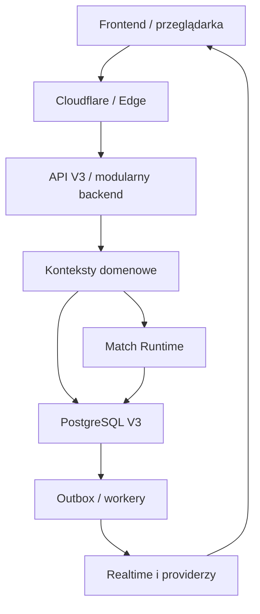
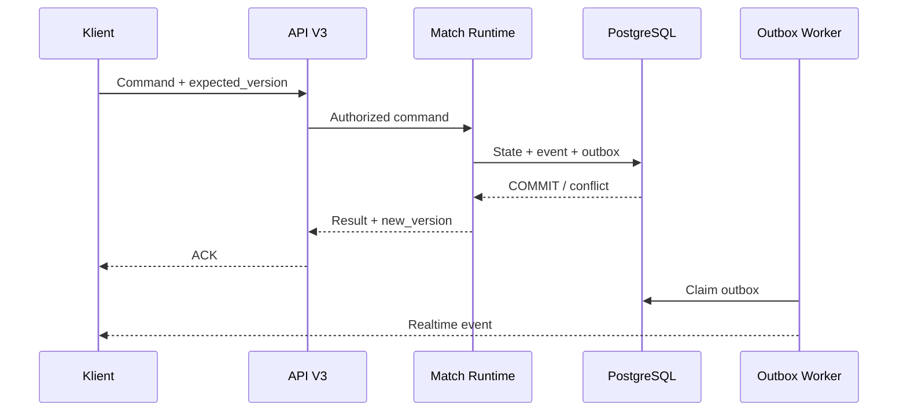

# Gracz.pl V3 — skonsolidowana architektura systemowa

Data: 31.08.2026  
Repozytorium: `developergracz/gracz-pl-2`  
Ścieżka docelowa: `Nowa dokumentacja Gracz.pl/01-ARCHITEKTURA/03-SKONSOLIDOWANA-ARCHITEKTURA-SYSTEMOWA-GRACZ-PL-V3.md`  
Wersja: `0.2`  
Status: **DESIGN DRAFT / REVIEW PENDING / NOT DEPLOYED / FREEZE-SAFE**

> Ten dokument konsoliduje stan obecny i docelową architekturę Gracz.pl V3. Nie jest dowodem wdrożenia, nie udziela zgody operacyjnej i nie zmienia produkcji, Rendera, Cloudflare, bazy danych ani sekretów.

## 0. Obowiązujący stan operacyjny

```text
E4.1-H = PENDING / SAFE HOLD
FREEZE = ACTIVE
FORMAL T-GATES = NOT EXECUTED
C0-S1 / C0-S3 / A1 / A2 / A3 = NOT AUTHORIZED
AUTHORIZED OPERATIONS = NONE
PRODUCTION / RENDER / SECRETS = UNCHANGED
PR #26 = OPEN / DRAFT / NOT MERGED
PRODUCTION V3 = NO-GO
```

Utworzenie i przegląd tego dokumentu są pracą dokumentacyjną. Nie stanowią obejścia żadnej blokady ani autoryzacji.

## 1. Cel

Celem dokumentu jest ustanowienie jednej kanonicznej mapy całego systemu Gracz.pl V3, obejmującej:

- frontend i doświadczenie użytkownika,
- backend i API,
- logowanie, sesje, RBAC i MFA,
- PostgreSQL V3,
- platformę gier i Match Runtime,
- lobby, obecność i realtime,
- wiadomości, chat i załączniki,
- integracje z providerami,
- storage,
- Render, Cloudflare i sieć,
- bezpieczeństwo,
- obserwowalność,
- odporność, backup i recovery,
- granice odpowiedzialności komponentów,
- ścieżkę przejścia ze stanu obecnego do V3.

Dokument nie zastępuje szczegółowych projektów bazodanowych, migracyjnych, bezpieczeństwa ani runbooków. Ustala nadrzędne granice i kontrakty, do których dokumenty szczegółowe muszą być zgodne.

## 2. Zakres i wyłączenia

### 2.1. W zakresie

- logiczna architektura V3,
- stan AS-IS potwierdzony kodem i istniejącym inventory,
- docelowe komponenty i zależności,
- własność danych i odpowiedzialność za zapisy,
- podstawowe przepływy danych i komend,
- model spójności, idempotencji i publikacji zdarzeń,
- model awarii i odzyskiwania,
- model skalowania,
- granice bezpieczeństwa i obserwowalności,
- backlog otwartych decyzji architektonicznych.

### 2.2. Poza zakresem

- wykonywanie migracji,
- deploy lub zmiana konfiguracji Rendera,
- zmiana DNS lub Cloudflare,
- tworzenie, kopiowanie albo rotacja sekretów,
- wybór płatnego planu providera,
- uruchomienie E4.1-H,
- wykonanie bramek T-serii,
- nadanie zgód C0-S1/C0-S3/A1/A2/A3,
- produkcyjny GO.

## 3. Klasyfikacja twierdzeń i hierarchia dowodów

Każde istotne twierdzenie architektoniczne należy interpretować zgodnie z jedną z czterech klas:

| Klasa | Znaczenie |
|---|---|
| `AS-IS CONFIRMED` | potwierdzone aktualnym kodem lub odczytanym artefaktem repozytorium |
| `TARGET DESIGN` | docelowy kontrakt, jeszcze niewdrożony albo niepotwierdzony produkcyjnie |
| `DECISION REQUIRED` | wariant wymagający osobnego ADR lub decyzji właściciela |
| `FRESH EVIDENCE REQUIRED` | stan może zależeć od środowiska i wymaga świeżego, bezpiecznego dowodu |

Hierarchia źródeł:

1. dla stanu kodu AS-IS — aktualny kod na wskazanym branchu,
2. dla stanu produkcji — wyłącznie fresh evidence z kontrolowanego odczytu,
3. dla target design — zatwierdzone dokumenty architektoniczne i ADR-y,
4. dla wykonania — formalne zgody, runbook i evidence powykonawcze.

Jeżeli dokument i kod są sprzeczne, stan AS-IS wynika z kodu. Jeżeli dokument opisuje target bez dowodu wdrożenia, pozostaje `TARGET DESIGN`.

## 4. Źródła wejściowe

Podstawowe źródła tej konsolidacji:

- `01-ARCHITEKTURA/01-BAZA-AUDYTU-ARCHITEKTURY.md`,
- `01-ARCHITEKTURA/02-ARCHITEKTURA-DOCELOWA-BACKEND-V3.md`,
- `02-BAZA-DANYCH/20-POSTGRESQL-V3-FINAL.md`,
- `03-MIGRACJA/13-WRITER-READER-INVENTORY.md`,
- `03-MIGRACJA/14-WORKER-EVENT-REALTIME-INVENTORY.md`,
- `03-MIGRACJA/39-GATE-14D-PRODUCTION-SECURITY-CONFIG-DESIGN.md`,
- `03-MIGRACJA/40-GATE-14D-PRODUCTION-ENV-CONTRACT.md`,
- `03-MIGRACJA/44-GATE-15-ETAP4-ENTRY-CONTRACT.md`,
- `03-MIGRACJA/52-ROADMAP-V3-TO-PRODUCTION-AND-GAMES.md`,
- `03-MIGRACJA/53-ENTERPRISE-GRADE-DEFINITION-V3.md`,
- pakiet E4.1-H `62–77`,
- `modern/checkers-engine/src/`,
- `modern/checkers-engine/web/`,
- `modern/checkers-engine/tests/`,
- `modern/checkers-engine/Dockerfile`,
- `modern/checkers-engine/package.json`.

## 5. Stan obecny — AS-IS

### 5.1. Runtime

`AS-IS CONFIRMED`

- backend jest aplikacją Node.js uruchamianą jako jeden proces,
- `src/main.js` pełni rolę composition root,
- aplikacja korzysta z natywnego serwera HTTP,
- frontend statyczny jest obsługiwany przez ten sam runtime,
- PostgreSQL jest dostępny przez bibliotekę `pg`,
- uruchomienie używa `pg-secure-preload.cjs`,
- w tym samym procesie składane są moduły auth, kont, RBAC/MFA, audytu, moderacji, lobby, rankingu, turniejów, wiadomości, newslettera oraz gier.

### 5.2. Realtime i stan procesowy

`AS-IS CONFIRMED`

- transport realtime używa obecnie SSE w wybranych obszarach,
- mapy połączeń i część obecności są lokalne dla procesu,
- restart procesu może zerwać bieżące połączenia i stan nietrwały,
- realtime nie posiada obecnie pełnego, potwierdzonego wspólnego backplane,
- brak potwierdzonego osobnego realtime gateway.

### 5.3. Gry

`AS-IS CONFIRMED`

- logika kilku gier jest zintegrowana z tym samym runtime,
- Gomoku posiada elementy stanu utrzymywanego w pamięci procesu,
- Warcaby nie używają jeszcze wszędzie aktywnego CAS opartego o wersję agregatu,
- nie istnieje potwierdzony distributed single-writer dla pojedynczego meczu,
- docelowy wspólny Match Runtime nie jest jeszcze wdrożony.

### 5.4. Zdarzenia i workery

`AS-IS CONFIRMED`

- nie ma wdrożonego transakcyjnego outboxa dla wszystkich skutków ubocznych,
- część wywołań providera wykonywana jest w request path,
- część operacji dodatkowych ma charakter best-effort,
- nie ma potwierdzonego, oddzielnego procesu worker/cron pokrywającego wszystkie wymagane zadania,
- procesowy monitoring bezpieczeństwa nie jest współdzielonym durable subsystemem.

### 5.5. Ograniczenia AS-IS

Najważniejsze ograniczenia:

- możliwość utraty stanu nietrwałego po restarcie,
- brak pełnej gwarancji one-writer-per-aggregate,
- brak atomowej publikacji wszystkich zdarzeń biznesowych,
- utrudnione skalowanie poziome SSE i obecności,
- sprzężenie request path z providerami,
- niejednolity model retry i idempotencji,
- ryzyko różnic między stanem domenowym a komunikatem wysłanym do klienta lub providera.

## 6. Zasady nadrzędne V3

`TARGET DESIGN`

1. **PostgreSQL jest trwałym źródłem prawdy.**
2. **Każdy agregat ma jednego skutecznego writera w danym momencie.**
3. **Zmiana stanu biznesowego i zapis outboxa są jednym commitem.**
4. **Każda ponawialna komenda ma klucz idempotencji.**
5. **Równoległość jest kontrolowana przez wersję, CAS i — gdzie wymagane — fencing.**
6. **Realtime transportuje informację, ale nie jest źródłem prawdy.**
7. **Kontekst domenowy zapisuje wyłącznie dane, których jest właścicielem.**
8. **Integracje zewnętrzne są wykonywane przez adaptery i workery, nie przez domenę.**
9. **Bezpieczeństwo produkcyjne działa fail-closed.**
10. **Każda istotna operacja jest obserwowalna przez correlation ID, metryki i audyt.**
11. **Rollback i recovery są częścią projektu, a nie dodatkiem po wdrożeniu.**
12. **Fizyczne mikroserwisy nie są celem samym w sobie.**

## 7. Architektura docelowa — widok logiczny



Schemat jest logiczny. Nie przesądza jeszcze liczby procesów, konkretnego brokera, konkretnego shared store ani planu providera.

## 8. Model wdrożeniowy

### 8.1. Etap docelowy przejściowy

`TARGET DESIGN`

Preferowany etap przejściowy to modularny monolit z fizycznie wydzielonymi elementami wymagającymi niezależnego cyklu życia:

- `api-v3`,
- `match-runtime-v3`,
- `worker-v3`,
- `realtime-v3`,
- PostgreSQL V3,
- broker lub shared ephemeral store po osobnej decyzji.

Nie wszystkie elementy muszą zostać wydzielone jednocześnie. Kontrakty logiczne mają powstać przed fizycznym podziałem.

### 8.2. Warunek fizycznego wydzielenia

Usługa może zostać wydzielona, gdy co najmniej jeden z warunków jest udowodniony:

- potrzebuje niezależnego skalowania,
- ma odmienny profil awarii lub bezpieczeństwa,
- wymaga osobnego ownershipu operacyjnego,
- blokuje niezależne wdrożenia,
- jej izolacja zmniejsza mierzalne ryzyko,
- istnieją metryki uzasadniające koszt operacyjny.

## 9. Granice odpowiedzialności

| Komponent | Odpowiada za | Nie może być źródłem |
|---|---|---|
| Frontend | prezentację, dostępność UI, lokalny stan widoku, wysyłanie komend | kanonicznego stanu meczu, salda, roli lub sesji |
| Cloudflare / Edge | DNS, TLS, ochronę brzegu, challenge i kontrolowane nagłówki | reguł biznesowych i autoryzacji domenowej |
| API V3 | uwierzytelnienie, autoryzację, walidację, routing i orkiestrację use case | trwałej prawdy przechowywanej wyłącznie w pamięci procesu |
| Kontekst domenowy | reguły biznesowe, agregaty i własne transakcje | bezpośrednich zapisów do tabel innego kontekstu |
| Match Runtime | sekwencjonowanie komend meczu i single-writer ownership | trwałości bez PostgreSQL |
| PostgreSQL V3 | kanoniczny stan, constraints, wersje, outbox i idempotency records | transportu realtime |
| Worker | retry, publikację, integracje i kontrolowane skutki uboczne | omijania reguł domenowych |
| Realtime Gateway | subskrypcje i dostarczenie zmian do klientów | kanonicznego stanu biznesowego |
| Provider Adapter | izolację API zewnętrznego i mapowanie błędów | decyzji domenowej |
| Observability | logi, metryki, tracing, alerty i diagnostykę | wartości sekretów i pełnych danych wrażliwych |

## 10. Bounded contexts

### 10.1. Identity & Access

Odpowiada za:

- konta,
- logowanie i sesje,
- odzyskiwanie konta,
- RBAC,
- MFA,
- credential lifecycle,
- security events związane z tożsamością.

Nie odpowiada za profile gry, ranking ani uczestnictwo w turnieju.

### 10.2. Audit

Odpowiada za:

- append-only zapis zdarzeń audytowych,
- integralność i retencję audytu,
- bezpieczną pseudonimizację identyfikatorów,
- dostęp kontrolowany rolami.

### 10.3. Game Platform

Odpowiada za:

- katalog gier,
- konfigurację wariantów,
- tworzenie meczu,
- wspólne identyfikatory gry i meczu,
- kontrakty silników gier.

### 10.4. Match Runtime

Odpowiada za:

- własność aktywnego meczu,
- kolejność komend,
- walidację oczekiwanej wersji,
- przejście stanu silnika,
- zapis snapshotu/historii zgodnie z wybraną strategią,
- wynik meczu i zdarzenia domenowe.

### 10.5. Tournament

Odpowiada za:

- definicję turnieju,
- uczestników,
- drabinkę i rundy,
- powiązanie `Tournament Match -> Game Match`,
- kontrolowane przejścia faz turnieju.

### 10.6. Messaging

Odpowiada za:

- prywatne wiadomości,
- skrzynki i status odczytu,
- szyfrowany payload,
- metadane załączników,
- autoryzację dostępu odbiorcy i nadawcy.

### 10.7. Global Chat & Social

Odpowiada za:

- kanały globalne,
- obecność i relacje społeczne,
- moderowalny strumień komunikacji,
- publikację zdarzeń realtime.

### 10.8. Moderation

Odpowiada za:

- zgłoszenia,
- blokady i działania moderatorów,
- reguły egzekwowania decyzji,
- audyt decyzji.

### 10.9. Newsletter

Odpowiada za:

- subskrypcje i zgody,
- kampanie i ich stan,
- przygotowanie delivery jobs,
- lifecycle wysyłki i wynik providera.

## 11. Kontrakt komendy

`TARGET DESIGN`

Minimalny command envelope powinien zawierać:

| Pole | Cel |
|---|---|
| `command_id` | idempotencja i deduplikacja |
| `command_type` | routing do właściwego handlera |
| `aggregate_id` | wskazanie właściciela stanu |
| `expected_version` | optimistic concurrency control |
| `actor_id` | tożsamość wykonującego |
| `correlation_id` | powiązanie całego przepływu |
| `causation_id` | wskazanie przyczyny |
| `issued_at` | diagnostyka i polityka ważności |
| `payload` | dane komendy zgodne ze schematem |

Handler musi rozróżniać:

- komendę nową,
- bezpieczne ponowienie już zakończonej komendy,
- konflikt wersji,
- brak autoryzacji,
- niepoprawny payload,
- utratę ownershipu/fence,
- błąd przejściowy i trwały.

## 12. Przepływ komendy gry



Normatywne warunki:

1. ACK sukcesu nie może powstać przed zatwierdzeniem transakcji kanonicznego stanu.
2. Stan meczu, event domenowy i outbox wymagający publikacji są zapisywane atomowo.
3. Konflikt wersji nie może zostać zamieniony w ciche nadpisanie.
4. Ponowienie `command_id` nie może wywołać podwójnego efektu.
5. Realtime może zostać opóźniony lub utracony bez utraty stanu domenowego.

## 13. Frontend V3

### 13.1. Odpowiedzialność

Frontend odpowiada za:

- routing i prezentację ekranów,
- dostępność i responsywność,
- lokalny stan interakcji,
- wysyłanie komend,
- obsługę stanu oczekiwania, konfliktu i retry,
- reconnect oraz ponowne pobranie kanonicznego snapshotu,
- spójne komponenty marki Gracz.pl.

### 13.2. Zakazy

Frontend nie może:

- samodzielnie zatwierdzać wyniku meczu,
- być jedynym miejscem przechowywania aktywnej partii,
- ufać roli lub uprawnieniom zapisanym wyłącznie po stronie klienta,
- interpretować ACK transportowego jako sukces transakcji bez kontraktu API,
- przechowywać sekretów serwerowych.

### 13.3. Otwarte decyzje

`DECISION REQUIRED`

- docelowy framework lub utrzymanie lekkiego frontend stack,
- router,
- model stanu klienta,
- strategia cache i invalidacji,
- standard komponentów i design system,
- kontrakt offline/reconnect.

## 14. Backend/API V3

API V3 jest warstwą wejściową i orkiestracyjną. Powinno zapewniać:

- parsing i walidację schematów,
- identyfikację użytkownika i sesji,
- autoryzację use case,
- rate limiting i abuse controls,
- utworzenie correlation ID,
- przekazanie command/query do właściciela domenowego,
- stabilne kody błędów,
- brak ekspozycji wewnętrznych wyjątków,
- kontrolowany compatibility layer podczas migracji.

API nie powinno zawierać reguł gry, bezpośrednich wywołań SQL należących do innego kontekstu ani bezpośrednich skutków ubocznych wymagających retry.

### 14.1. Query API, wersjonowanie i cykl życia kontraktów

`TARGET DESIGN`

Ścieżki odczytowe muszą być jawnie oddzielone od komend. Query API:

- nie mutuje stanu domenowego jako efekt uboczny zwykłego odczytu,
- korzysta z kanonicznego agregatu albo nazwanej projekcji/read modelu,
- posiada określonego właściciela danych i schematu odpowiedzi,
- stosuje stabilną paginację, deterministyczne sortowanie i jawne limity,
- nie ujawnia pól wewnętrznych, sekretów ani danych bez podstawy autoryzacyjnej,
- raportuje wersję/świeżość projekcji, gdy eventual consistency ma znaczenie,
- ma zdefiniowaną semantykę `not found`, `forbidden`, `conflict` i `temporarily unavailable`.

Kontrakt API podlega wersjonowaniu. Zmiana niekompatybilna wymaga:

1. nowej wersji albo kontrolowanego compatibility adaptera,
2. okresu równoległego wsparcia określonego decyzją,
3. telemetry użycia starego kontraktu,
4. komunikatu deprecation,
5. formalnego kryterium usunięcia,
6. testu, że aktywny klient nie zależy od usuwanego pola lub endpointu.

Dokładny standard wersjonowania i deprecation jest objęty `ADR-V3-014`.

## 15. Logowanie, sesje i autoryzacja

`TARGET DESIGN`

### 15.1. Sesja

- serwer jest źródłem prawdy o sesji,
- identyfikator sesji jest przekazywany przez bezpieczne cookie,
- cookie produkcyjne używa `Secure`, `HttpOnly` i właściwego `SameSite`,
- zmiana uprawnień może unieważnić lub ograniczyć sesję,
- rotacja i wylogowanie są audytowalne.

### 15.2. RBAC i MFA

- role i ich historia mają jeden kanoniczny model,
- decyzja autoryzacyjna jest wykonywana po stronie serwera,
- MFA secret jest szyfrowany oddzielnym kluczem,
- operacje uprzywilejowane wymagają jawnego audytu,
- brak roli jest stanem odmowy, nie domyślnego zezwolenia.

### 15.3. Recovery

- tokeny odzyskiwania są jednorazowe, ograniczone czasowo i nie są logowane,
- odpowiedzi nie ujawniają istnienia konta,
- provider e-mail/SMS jest adapterem,
- failure providera nie może zostawić niejednoznacznego stanu domenowego.

## 16. PostgreSQL V3

`TARGET DESIGN / NOT DEPLOYED`

PostgreSQL V3 odpowiada za:

- trwały stan agregatów,
- klucze i referential integrity,
- constraints wymuszające niezmienniki,
- wersje agregatów,
- rejestr idempotencji,
- transactional outbox,
- projekcje odczytowe,
- audyt i historię zgodnie z polityką retencji.

### 16.1. Własność zapisu

Każda tabela musi mieć jednego logicznego właściciela. Inne konteksty komunikują się przez:

- publiczny kontrakt aplikacyjny,
- komendy,
- zdarzenia,
- kontrolowane read models,
- jawnie opisane integracyjne foreign keys, jeżeli są wymagane.

Bezpośredni zapis do tabel innego kontekstu jest zabroniony.

### 16.2. Role bazy

- runtime używa dedykowanego principal o minimalnych uprawnieniach,
- migrator używa osobnego credentiala,
- runtime nie posiada DDL/admin privileges,
- credentiale używają SCRAM-SHA-256,
- publiczny transport wymaga zweryfikowanego TLS,
- prywatny transport Render wymaga fresh topology evidence.

### 16.3. Read models, projekcje i ranking

`TARGET DESIGN`

Read model jest odbudowywalnym widokiem zoptymalizowanym dla zapytań. Nie może stać się drugim, niekontrolowanym źródłem prawdy.

Każda projekcja musi posiadać:

- nazwany kontekst-właściciela,
- wskazany event lub dane źródłowe,
- wersję schematu projekcji,
- idempotentnego projectora,
- trwały checkpoint albo równoważny mechanizm wznowienia,
- jawny model kolejności i obsługi duplikatów,
- procedurę pełnego rebuild,
- metrykę lag/freshness,
- reguły publikacji dopiero po osiągnięciu wymaganej spójności.

Ranking jest projekcją Game Platform, a nie niezależnym writerem wyniku meczu. Wynik meczu pochodzi z kanonicznego Match Runtime; ranking konsumuje zatwierdzony event i może zostać odbudowany bez modyfikowania historii meczów.

Minimalne zabezpieczenia:

- unikalność przetworzenia `event_id`,
- brak naliczenia punktów na podstawie niezatwierdzonego wyniku,
- deterministyczny rebuild dla tego samego zakresu zdarzeń,
- izolacja uszkodzonego eventu bez zatrzymania całego systemu,
- porównanie sum kontrolnych/liczników po rebuild.

Szczegółowa strategia checkpointów, rebuild i udostępniania projekcji jest objęta `ADR-V3-013`.

## 17. Match Runtime i platforma gier

### 17.1. Wspólny kontrakt silnika

Każdy silnik gry powinien udostępniać logicznie:

- `initialState(config)`,
- `validateCommand(state, command, actor)`,
- `applyCommand(state, command)`,
- `deriveEvents(previousState, newState, command)`,
- `isFinished(state)`,
- `result(state)`,
- wersjonowany format snapshotu.

### 17.2. Single writer

Dla pojedynczego `match_id` tylko jeden owner może skutecznie zatwierdzać komendy. PostgreSQL V3 ustala normatywny model `match_actor_leases` z rosnącym fencing tokenem. Mechanizm musi obejmować:

- rekord lease przypisany do `match_id`,
- jednoznaczny `owner_id`,
- termin ważności i kontrolowane odnowienie lease,
- monotonically increasing fencing token przy przejęciu ownershipu,
- `expected_version`,
- CAS w PostgreSQL,
- deterministyczny wynik konfliktu,
- odrzucenie zapisu starego ownera nawet wtedy, gdy jego proces nadal działa.

`ADR-V3-004` nie wybiera ponownie modelu ownershipu. Ma rozstrzygnąć szczegóły egzekwowania ustalonego modelu: atomowe acquire/renew/release, TTL, heartbeat, transakcyjne sprawdzanie fencing tokenu, routing po `match_id`, handoff, zachowanie po timeout oraz testy split-brain.

### 17.3. Kolejność migracji gier

Docelowa kolejność referencyjna:

1. wspólny fundament Match Runtime,
2. Warcaby jako pierwsza pełna implementacja referencyjna,
3. Tysiąc,
4. persistence Gomoku i migracja do wspólnego runtime,
5. kolejne gry wyłącznie przez wspólny kontrakt.

## 18. Lobby, presence i realtime

### 18.1. Durable i ephemeral state

Należy jawnie rozdzielić:

- trwałe dane lobby i meczu — PostgreSQL,
- chwilową obecność, connection registry i subscription state — shared ephemeral store lub kontrolowany gateway,
- zdarzenia do publikacji — transactional outbox,
- dane klienta — cache możliwy do odbudowania.

### 18.2. Reconnect

Po reconnect klient powinien:

1. uwierzytelnić aktualną sesję,
2. pobrać kanoniczny snapshot lub read model,
3. porównać wersję,
4. ponownie utworzyć subskrypcję,
5. dopiero potem przyjmować kolejne zdarzenia realtime.

Nie wolno zakładać, że klient otrzymał każde zdarzenie transportowe.

### 18.3. Transport

`DECISION REQUIRED`

Należy porównać SSE i WebSocket dla:

- kierunku komunikacji,
- skalowania,
- reconnect,
- load balancingu,
- backpressure,
- kompatybilności z Cloudflare/Render,
- kosztu utrzymania.

## 19. Wiadomości, chat i załączniki

### 19.1. Wiadomości prywatne

- metadane i zaszyfrowany payload są trwałe,
- tylko rekordy `enc:v1`/kolejnych wersji są dowodem działania deszyfracji,
- rekord legacy czytelny bez decrypt nie może być klasyfikowany jako sukces kryptograficzny,
- autoryzacja dostępu jest sprawdzana serwerowo,
- preview/logi nie ujawniają plaintextu.

### 19.2. Global chat

- publikacja realtime jest oddzielona od trwałości,
- moderacja i blokady są egzekwowane przed publikacją,
- historia ma zdefiniowaną retencję,
- utrata realtime nie może usuwać kanonicznego wpisu, jeżeli wpis ma być trwały.

### 19.3. Załączniki

Docelowy model powinien rozdzielać:

- metadane i ownership — PostgreSQL,
- binarny payload — obecny mechanizm przejściowy lub docelowy object storage,
- szyfrowanie — osobny attachment key,
- kontrolę MIME/rozmiaru,
- skanowanie bezpieczeństwa,
- retencję i bezpieczne usuwanie.

Wybór object storage pozostaje `DECISION REQUIRED`.

## 20. Outbox, workery i integracje

### 20.1. Transactional outbox

Każda operacja wymagająca niezawodnej publikacji zapisuje rekord outbox w tej samej transakcji co stan domenowy.

Minimalne pola:

- `event_id`,
- `event_type`,
- `aggregate_type`,
- `aggregate_id`,
- `aggregate_version`,
- `correlation_id`,
- `causation_id`,
- `payload`,
- `created_at`,
- stan publikacji/claim zgodny z wybraną implementacją.

### 20.2. Worker

Worker musi zapewniać:

- bezpieczne claimowanie,
- retry z backoff,
- idempotentnego consumera,
- rozróżnienie błędu przejściowego i trwałego,
- dead-letter/quarantine po wyczerpaniu polityki,
- metryki opóźnienia i błędów,
- kontrolowany shutdown.

### 20.3. Providerzy

Adapter providera:

- nie ujawnia credentiali,
- normalizuje timeouty i błędy,
- zapisuje bezpieczny provider result,
- nie decyduje o regułach domenowych,
- umożliwia testy bez realnej wysyłki.

## 21. Storage

### 21.1. Kategorie danych

| Kategoria | Docelowa odpowiedzialność |
|---|---|
| dane domenowe | PostgreSQL V3 |
| snapshoty i eventy meczu | PostgreSQL lub zatwierdzony model hybrydowy |
| pliki/załączniki | object storage po ADR; metadane w PostgreSQL |
| stan obecności | shared ephemeral store po ADR |
| logi i metryki | zatwierdzona platforma observability |
| sekrety | provider secret/environment store |
| backupy | izolowany mechanizm zgodny z RPO/RTO i retencją |

### 21.2. Zakazy

- lokalny filesystem kontenera nie jest trwałym production storage,
- sekrety nie trafiają do repozytorium, dokumentacji, logów ani screenshotów,
- cache nie zastępuje źródła prawdy,
- backup nie jest uznany za poprawny bez testu restore.

## 22. Render, Cloudflare i sieć

### 22.1. Potwierdzone kontrakty projektowe

- canonical public origin: `https://gracz.pl`,
- `www.gracz.pl` może przekierowywać do canonical origin,
- produkcja wymaga `NODE_ENV=production`,
- Turnstile wymaga kompletnej pary i hostname binding,
- połączenie publiczne z DB wymaga zweryfikowanego TLS,
- prywatne połączenie Render jest dopuszczalne po fresh evidence,
- proxy headers pozostają niezaufane do czasu dowodu topologii.

### 22.2. Elementy wymagające fresh evidence

`FRESH EVIDENCE REQUIRED`

- faktyczna ścieżka klient → Cloudflare → origin,
- możliwość bezpośredniego dostępu do origin,
- semantyka `CF-Connecting-IP` i `X-Forwarded-For`,
- publiczny/prywatny tryb połączenia PostgreSQL,
- aktualne plany i możliwości usług Render,
- health checks i zachowanie restartu,
- rzeczywisty canonical redirect.

Bez tych dowodów nie wolno automatycznie ustawiać `TRUST_CLOUDFLARE_HEADERS=true` ani `TRUST_PROXY_HEADERS=true`.

## 23. Bezpieczeństwo

### 23.1. Kontrakt production fail-closed

- brak wymaganej konfiguracji bezpieczeństwa blokuje funkcję,
- partial provider configuration jest błędem,
- brak autoryzacji oznacza odmowę,
- niepoprawny token/challenge nie ma bypassu produkcyjnego,
- zewnętrzny timeout nie zmienia niejednoznacznie stanu domenowego.

### 23.2. Separacja sekretów

Docelowo rozdzielone są co najmniej:

- `AUTH_SECRET`,
- `AUDIT_HASH_SALT`,
- klucz wiadomości,
- klucz załączników,
- klucz MFA,
- legacy crypto root w okresie kompatybilności,
- runtime DB credential,
- migrator DB credential,
- provider credentials.

Żaden dokument ani verifier nie może ujawniać wartości, connection stringów ani fingerprintów pozwalających korelować sekret.

### 23.3. Ochrona aplikacyjna

Architektura musi uwzględniać:

- walidację wejścia,
- rate limiting,
- bot defense,
- CSRF i bezpieczne cookies,
- output encoding,
- kontrolę uploadów,
- moderację i abuse prevention,
- dependency i supply-chain scanning,
- least privilege,
- audyt operacji uprzywilejowanych.

### 23.4. Data Governance & Privacy

`TARGET DESIGN`

Każda klasa danych musi posiadać właściciela, cel przetwarzania, klasyfikację, retencję, podstawę dostępu oraz procedurę usunięcia lub trwałej anonimizacji.

| Klasa | Przykłady | Minimalny kontrakt |
|---|---|---|
| Public | nazwa gry, publiczny ranking, jawny profil | integralność, moderacja, kontrola publikacji |
| Internal | identyfikatory techniczne, konfiguracja niesekretna | dostęp według potrzeby, ograniczona ekspozycja |
| Personal | konto, e-mail, profil, historia aktywności | purpose limitation, kontrola dostępu, retencja i realizacja praw użytkownika |
| Sensitive | MFA, security signals, prywatne wiadomości, dane recovery | szyfrowanie, ścisły dostęp, audyt, minimalizacja |
| Secret | klucze, tokeny, credentiale | wyłącznie secret store; zakaz logowania i utrwalania w dokumentacji |

Normatywne wymagania:

- zbieramy wyłącznie dane potrzebne do jawnego celu,
- właściciel kontekstu odpowiada za retencję i usunięcie,
- usunięcie konta nie może przypadkowo niszczyć wymaganych dowodów zgód, audytu lub legal hold,
- legal/audit hold wstrzymuje wyłącznie dane objęte podstawą i jest rejestrowany,
- eksport danych nie może ujawniać danych innych użytkowników ani sekretów systemowych,
- kopie zapasowe mają osobny harmonogram wygaśnięcia i procedurę obsługi usuniętych danych,
- dane testowe nie używają niezanonimizowanych danych produkcyjnych bez formalnej podstawy,
- telemetry i logi podlegają tej samej klasyfikacji oraz polityce retencji.

`ADR-V3-012` ustala szczegółowe okresy retencji i legal hold dla każdej klasy danych. Brak ustalonego okresu oznacza `HOLD` dla automatycznego usuwania, a nie retencję bezterminową.

## 24. Obserwowalność

### 24.1. Minimalny standard

Każdy krytyczny przepływ powinien posiadać:

- `request_id`,
- `correlation_id`,
- `command_id` albo `event_id`,
- nazwę komponentu i operacji,
- wynik sklasyfikowany bez danych wrażliwych,
- czas trwania,
- metrykę błędu/retry,
- powiązanie z audytem, jeśli operacja jest uprzywilejowana.

### 24.2. Metryki obowiązkowe

- API latency/error rate,
- liczba aktywnych sesji i odrzuconych auth attempts,
- match command latency i conflict rate,
- outbox backlog i age najstarszego eventu,
- worker retry/dead-letter rate,
- realtime connections, reconnects i delivery failures,
- DB pool saturation i query latency,
- provider success/timeout/error rate,
- backup freshness i restore verification age.

### 24.3. Zakazy logowania

Nie logować:

- sekretów, tokenów i haseł,
- connection stringów,
- plaintextu wiadomości,
- MFA secret/provisioning URI,
- pełnych adresów e-mail,
- Turnstile response tokenów,
- surowego materiału kryptograficznego.

### 24.4. Incident Response

`TARGET DESIGN`

System musi posiadać klasyfikację incydentów oraz przypisane ścieżki reakcji co najmniej dla:

- naruszenia konta lub sesji,
- ujawnienia albo podejrzenia ujawnienia sekretu,
- awarii lub korupcji PostgreSQL,
- błędu kryptograficznego/decryptability,
- nieudanego deployu lub migracji,
- niedostępności Match Runtime/realtime,
- utraty integralności outboxa lub projekcji,
- nadużyć, spamu i ataku automatycznego.

Każdy playbook powinien określać detekcję, severity, incident ownera, komunikację, containment, evidence preservation, recovery, kryteria zamknięcia i post-incident review. Działania destrukcyjne lub dotyczące sekretów wymagają osobnej autoryzacji.

### 24.5. Operational Ownership

Każdy komponent krytyczny musi mieć przypisaną co najmniej jedną rolę odpowiedzialną za:

- decyzje architektoniczne,
- utrzymanie kodu,
- deploy i rollback,
- dane i migracje,
- bezpieczeństwo oraz rotację credentiali,
- alerty i reakcję na incydent,
- backup i recovery,
- akceptację ryzyka.

Minimalny cykl przypisania roli:

```text
UNASSIGNED -> NOMINATED -> ACCEPTED -> VERIFIED -> ACTIVE
```

Samo wpisanie nazwy osoby nie ustanawia odpowiedzialności bez jawnej akceptacji i mandatu. Szczegółowy model ownershipu i eskalacji jest objęty `ADR-V3-015`.

## 25. Model awarii i recovery

| Awaria | Wymagane zachowanie |
|---|---|
| restart API | brak utraty kanonicznego stanu; klient może ponowić bez podwójnego efektu |
| utrata realtime | reconnect i resynchronizacja z trwałego snapshotu/read modelu |
| duplikat komendy | zwrot poprzedniego wyniku lub deterministyczna deduplikacja |
| dwóch writerów | tylko owner z aktualnym fence/version może zatwierdzić zapis |
| konflikt wersji | jawny conflict; brak cichego nadpisania |
| awaria workera | niezatwierdzony event pozostaje do ponowienia |
| awaria providera | retry/quarantine; stan domenowy pozostaje jednoznaczny |
| broker niedostępny | outbox rośnie, ale zatwierdzony stan nie ginie |
| PostgreSQL niedostępny | operacja mutująca failuje bez fałszywego ACK |
| błędny event | quarantine/dead-letter, alert i zachowanie chain of custody |
| utrata kontenera | odbudowa z obrazu i trwałych zależności, nie z local filesystem |
| utrata danych | recovery wyłącznie z backupu potwierdzonego testem restore |

## 26. Skalowanie i wydajność

### 26.1. Poziome skalowanie API

API może być skalowane poziomo, jeśli:

- nie przechowuje kanonicznego stanu w pamięci,
- sesje są współdzielone/trwałe,
- rate limiting i abuse state mają poprawny model współdzielenia,
- idempotencja działa między instancjami,
- health/readiness odróżniają proces żywy od gotowego.

### 26.2. Skalowanie Match Runtime

Wymaga:

- routingu po `match_id`,
- distributed ownership,
- fencing,
- odtwarzalnego snapshotu,
- kontrolowanego handoffu,
- metryk hot partitions i command latency.

### 26.3. Skalowanie realtime

Wymaga:

- wspólnego backplane lub deterministycznego routingu,
- reconnect i resync,
- limitów połączeń,
- backpressure,
- ochrony przed powolnym klientem,
- braku zależności prawdy domenowej od lokalnej mapy połączeń.

## 27. Deployment, konfiguracja i release

### 27.1. Środowiska

Docelowo rozróżnia się:

- development,
- test,
- staging/pre-production,
- production.

Każde środowisko ma własne credentiale i nie współdzieli sekretów produkcyjnych.

### 27.2. Release contract

Release V3 wymaga:

- niezmiennego artefaktu,
- testów jednostkowych, integracyjnych i E2E,
- migracji backward-compatible albo kontrolowanego okna,
- health/readiness checks,
- obserwowalności przed ruchem,
- jawnego rollbacku,
- evidence po wdrożeniu,
- braku automatycznego production GO wynikającego wyłącznie z merge.

### 27.3. Migracje schematu

- wykonywane przez dedykowanego migratora,
- oddzielone od zwykłego runtime,
- sprawdzane pod kątem locków i czasu,
- posiadają preflight i postflight,
- mają plan rollback/forward-fix,
- nie niszczą danych legacy przed potwierdzonym cutover i retencją.

### 27.4. CI/CD i bezpieczeństwo łańcucha dostaw

`TARGET DESIGN`

Pipeline V3 powinien zapewniać:

- ochronę głównej gałęzi i wymagany review,
- wymagane testy przed merge,
- dependency, secret i static analysis scanning,
- generowanie SBOM dla artefaktu wdrożeniowego,
- przypięte i weryfikowane wersje zależności oraz akcji CI,
- minimalne uprawnienia tokenów automatyzacji,
- brak produkcyjnych sekretów w build logs i artefaktach,
- identyfikowalność commit -> build -> image -> deployment,
- niezmienny artefakt promowany między środowiskami,
- udokumentowaną obsługę podatności krytycznej,
- rollback do znanego artefaktu bez rebuild z innego kodu.

`ADR-V3-016` ustala konkretne narzędzia, wymagane kontrole, provenance/signing oraz reguły wyjątków. Merge sam w sobie nie oznacza production deploy ani production GO.

## 28. Droga AS-IS → V3

Referencyjna kolejność implementacyjna:

1. granice modułów, identyfikatory i command envelope,
2. transaction helpers, idempotency i CAS,
3. outbox, publisher i consumer framework,
4. kanoniczny model meczu,
5. Match Runtime,
6. Warcaby jako implementacja referencyjna,
7. Tysiąc,
8. persistence Gomoku i wspólny runtime,
9. powiązanie Tournament Match z Game Match,
10. turniejowy single writer,
11. realtime gateway oparty o event flow,
12. newsletter delivery przez outbox/worker,
13. konsolidacja ról i audytu,
14. migracja danych i okres obserwacji,
15. cleanup legacy dopiero po fresh proof.

Każdy krok musi posiadać własne kryteria wejścia, wyjścia, rollback i dowód. Ten dokument nie zmienia statusu istniejących bramek migracyjnych.

## 29. Backlog decyzji architektonicznych

### 29.1. Znaczenie priorytetów

- `P0` — musi zostać rozstrzygnięte albo formalnie zaakceptowane z właścicielem przed `REVIEWED DESIGN`.
- `P1` — musi zostać rozstrzygnięte przed rozpoczęciem zależnej implementacji albo przed production readiness, zgodnie z kolumną bramki.
- `P2` — może zostać odroczone do wersji 0.3, jeżeli granica interfejsu pozostaje stabilna, a odroczenie ma właściciela i kryterium wznowienia.

### 29.2. Rejestr ADR

| ADR | Priorytet | Decyzja | Bramka | Status |
|---|---:|---|---|---|
| `ADR-V3-001` | P2 | wybór brokera/event bus | przed event-driven deployment | `DEFERRED / PENDING` |
| `ADR-V3-002` | P2 | wybór shared ephemeral store | przed poziomym skalowaniem realtime/presence | `DEFERRED / PENDING` |
| `ADR-V3-003` | P1 | SSE, WebSocket lub model hybrydowy | przed pierwszym docelowym realtime slice | `PENDING` |
| [`ADR-V3-004`](../09-DECYZJE-ARCHITEKTONICZNE/ADR-V3-004-MATCH-RUNTIME-LEASE-FENCING-ENFORCEMENT.md) | P0 | egzekwowanie `match_actor_leases` i fencing | przed `REVIEWED DESIGN` | `ACCEPTED / FINAL` |
| `ADR-V3-005` | P1 | snapshot vs event log dla klas agregatów | przed implementacją trwałości danej klasy | `PENDING` |
| `ADR-V3-006` | P2 | storage załączników i skanowanie uploadów | przed migracją binarnego storage | `DEFERRED / PENDING` |
| `ADR-V3-007` | P2 | frontend stack, routing i state management | przed przebudową frontend shell | `DEFERRED / PENDING` |
| `ADR-V3-008` | P1 | observability stack i retencja telemetry | przed production readiness | `PENDING` |
| `ADR-V3-009` | P2 | progi fizycznego podziału deploymentów | przed wydzieleniem kolejnej usługi | `DEFERRED / PENDING` |
| `ADR-V3-010` | P1 | RPO, RTO, backup i disaster recovery | przed production readiness | `PENDING` |
| `ADR-V3-011` | P1 | trusted proxy i topologia Cloudflare–Render | przed zmianą proxy trust flags | `FRESH EVIDENCE REQUIRED` |
| [`ADR-V3-012`](../09-DECYZJE-ARCHITEKTONICZNE/ADR-V3-012-DATA-RETENTION-PRIVACY-DELETION-LEGAL-HOLD.md) | P0 | retencja, privacy deletion i legal hold | przed `REVIEWED DESIGN` | `PROPOSED / REVIEW PENDING` |
| [`ADR-V3-013`](../09-DECYZJE-ARCHITEKTONICZNE/ADR-V3-013-READ-MODEL-OWNERSHIP-CHECKPOINT-REBUILD.md) | P0 | ownership, checkpoint i privacy-safe rebuild read models | przed `REVIEWED DESIGN` | `PROPOSED / ARCHITECTURE PASS / P1 CORRECTIONS APPLIED / DELTA REVIEW PENDING` |
| `ADR-V3-014` | P1 | API versioning i deprecation | przed pierwszą zmianą niekompatybilną | `PENDING` |
| `ADR-V3-015` | P1 | operational ownership i incident escalation | przed production readiness | `PENDING` |
| `ADR-V3-016` | P1 | CI/CD provenance i supply-chain controls | przed production readiness | `PENDING` |

`ADR-V3-004` został formalnie zaakceptowany 31.08.2026. `ADR-V3-012` ma kompletną treść decyzyjną, przeszedł review architektoniczny i oczekuje na formalne zatwierdzenie Privacy/Legal. `ADR-V3-013` przeszedł niezależny review `PASS WITH 2 P1 CONDITIONS`; poprawki P1 i P2 zostały zastosowane, a krótki delta review pozostaje oczekujący. Bramka `REVIEWED DESIGN` pozostaje w `HOLD` do formalnego zamknięcia obu pozostałych pozycji P0.

Status `PENDING` nie jest błędem dokumentu. Oznacza jawnie kontrolowaną decyzję, której nie wolno zastępować założeniem. Status `DEFERRED` jest dozwolony tylko z zachowaną bramką i kryterium wznowienia.

## 30. Kryteria akceptacji dokumentu

Dokument może przejść z `DESIGN DRAFT` do `REVIEWED DESIGN`, gdy:

- stan AS-IS został porównany z aktualnym kodem,
- każde twierdzenie target jest oznaczone jako niewdrożone, jeśli brak fresh proof,
- wszystkie komponenty mają właściciela odpowiedzialności,
- wszystkie trwałe dane mają wskazane źródło prawdy,
- P0 ADR-y są rozstrzygnięte albo formalnie zaakceptowane z właścicielem i terminem,
- opisano przepływy komend, eventów i reconnect,
- read models mają ownership, checkpoint i procedurę rebuild,
- opisano podstawowe tryby awarii,
- wskazano zależności bezpieczeństwa i obserwowalności,
- klasy danych mają politykę retencji, privacy deletion i legal hold,
- zdefiniowano model incident response i operational ownership,
- zdefiniowano lifecycle API oraz kontrakt CI/CD/supply-chain,
- otwarte decyzje mają identyfikatory ADR,
- nie ma sekretów ani produkcyjnych connection strings,
- dokument nie udziela zgody operacyjnej,
- niezależny reviewer potwierdzi spójność z dokumentami źródłowymi.

## 31. Kryteria akceptacji wdrożenia V3

Architektura jest wdrożona dopiero, gdy fresh evidence potwierdzi co najmniej:

- brak dwóch skutecznych writerów jednego meczu,
- restart procesu nie powoduje utraty kanonicznego stanu,
- event wymagający publikacji jest atomowo związany z transakcją,
- retry komendy nie powoduje podwójnego efektu,
- utrata realtime nie powoduje utraty prawdy domenowej,
- reconnect odtwarza zgodny stan,
- turniej nie przekracza limitów przez race,
- wynik meczu nie może zostać zatwierdzony dwukrotnie,
- newsletter i inne integracje mają niezawodny lifecycle worker/outbox,
- role i audyt mają jeden kanoniczny model,
- runtime DB principal ma minimalne uprawnienia,
- backup przeszedł test restore,
- SLO i alerty są zdefiniowane oraz działają,
- wszystkie wymagane bramki i zgody są wykonane formalnie.

`REVIEWED DESIGN` nie jest równoznaczne z `IMPLEMENTED`, a `IMPLEMENTED` nie jest równoznaczne z `PRODUCTION GO`.

## 32. Ryzyka architektoniczne

Najważniejsze ryzyka do dalszego monitorowania:

- przedwczesne uznanie target design za stan produkcji,
- pozostawienie stanu gry w pamięci procesu,
- brak fencing przy skalowaniu Match Runtime,
- brak atomowego outboxa,
- przeciążenie jednego procesu odpowiedzialnościami,
- wybranie mikroserwisów bez uzasadnienia operacyjnego,
- zaufanie nagłówkom proxy bez topology proof,
- współdzielenie sekretów między domenami,
- backup bez zweryfikowanego restore,
- brak właścicieli ADR, SLO i incydentów,
- projekcje bez checkpointu, idempotencji lub kontrolowanego rebuild,
- brak klasyfikacji danych i wykonalnej polityki privacy deletion/legal hold,
- niekontrolowane zmiany API bez deprecation telemetry,
- brak identyfikowalności commit-build-artifact-deployment,
- usunięcie legacy przed potwierdzoną migracją,
- niekontrolowana retencja wiadomości, chatów i załączników.

## 33. Zasady aktualizacji

Każda przyszła zmiana tego dokumentu powinna zawierać:

- przyczynę zmiany,
- źródło dowodu,
- wpływ na AS-IS i TARGET,
- powiązany ADR lub gate,
- wpływ na bezpieczeństwo i dane,
- informację, czy zmiana jest wyłącznie dokumentacyjna,
- nową wersję i datę przeglądu.

Nie wolno aktualizować etykiety `IMPLEMENTED` lub `PRODUCTION` bez fresh evidence i formalnej decyzji.

## 34. Decyzja wersji 0.2

Wersja `0.2` zachowuje fundament 0.1 i dodatkowo wprowadza:

- normatywne doprecyzowanie `match_actor_leases` i fencing,
- kontrakt read models, projekcji i rankingu,
- Data Governance & Privacy,
- Incident Response i Operational Ownership,
- Query/API lifecycle oraz deprecation,
- CI/CD i supply-chain security,
- priorytety P0/P1/P2 oraz bramki dla 16 ADR-ów,
- precyzyjny status C0-S1/C0-S3/A1/A2/A3.

Wersja 0.2 pozostaje `DESIGN DRAFT / REVIEW PENDING` do czasu ponownego przeglądu. Sam zapis wersji nie nadaje statusu `REVIEWED DESIGN`.

Formalny status po zapisaniu:

```text
DOCUMENT V3 0.2 = MATERIALIZED / DESIGN DRAFT / REVIEW PENDING
IMPLEMENTATION = NOT STARTED BY THIS DOCUMENT
DEPLOYMENT = NOT AUTHORIZED
FREEZE = ACTIVE
PRODUCTION / RENDER / SECRETS = UNCHANGED
```

## 35. Historia wersji

| Wersja | Data | Status | Zakres |
|---|---|---|---|
| `0.1` | 31.08.2026 | `MATERIALIZED / CONSISTENT DESIGN DRAFT` | pierwsza skonsolidowana mapa AS-IS i TARGET V3 |
| `0.2` | 31.08.2026 | `MATERIALIZED / REVIEW PENDING` | poprawki po przeglądzie spójności, P0/P1/P2 i rozszerzenia enterprise |
