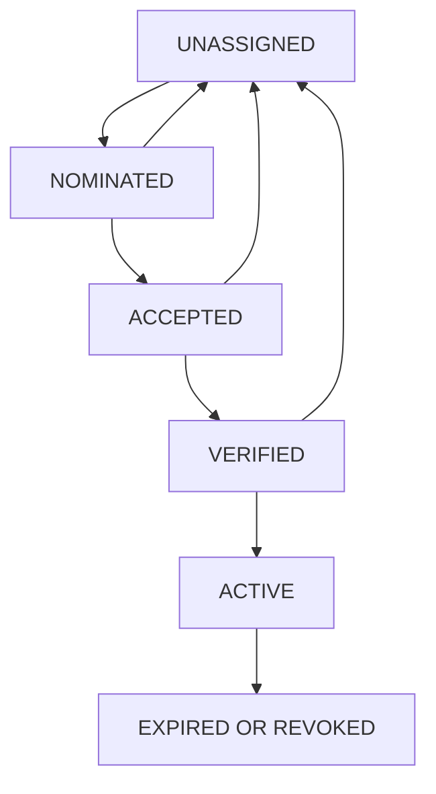

# ETAP 4 — E4.1-H Named Ownership and Continuity Decision Record for RSK-E41H-009

Data przygotowania: 31.08.2026  
Repozytorium: `developergracz/gracz-pl-2`  
Status: **OWNERSHIP CONTRACT READY / NAMED OWNERS PENDING / NO AUTHORIZATION GRANTED / FREEZE ACTIVE**  
Production V3: **NO-GO**

> Dokument ustanawia formalny rejestr właścicieli i decyzji dla `RSK-E41H-009`. Nie przypisuje odpowiedzialności bez świadomej akceptacji konkretnej osoby i nie autoryzuje backupu, upgrade, zakupu planu, utworzenia bazy, restore, cutover, wznowienia usługi, zmiany environment ani wykonania E4.1-H.

## 1. Stan wejściowy

```text
CONTINUITY PLAN = READY
CONTINUITY OPTION = PENDING
RSK-E41H-009 = OPEN / CRITICAL / TIME-BOUND
NAMED DATA OWNER = PENDING
NAMED BUSINESS SERVICE OWNER = PENDING
NAMED PROVIDER/BILLING OWNER = PENDING
NAMED CHANGE AUTHORIZER = PENDING
NAMED REVIEWERS = PENDING
A1–A3 = BLOCKED / NOT AUTHORIZED
E4.1-H = PENDING / SAFE HOLD
FREEZE = ACTIVE
PRODUCTION = UNCHANGED
RENDER = UNCHANGED
SECRETS = UNCHANGED
PR #26 = OPEN / DRAFT / NOT MERGED
PRODUCTION V3 = NO-GO
```

## 2. Cel dokumentu

Dokument ma:

1. określić wszystkie role wymagane do rozstrzygnięcia `RSK-E41H-009`,
2. ustanowić jednoznaczny rejestr nominacji, akceptacji i zastępstw,
3. rozdzielić odpowiedzialność od wykonywania operacji,
4. zapobiec autoryzacji przez osobę bez właściwego mandatu,
5. zdefiniować konflikty ról i minimalne niezależne review,
6. ustanowić rekord decyzji S1/S2/S3,
7. zapewnić eskalację przed wskazanym expiry 21.09.2026,
8. zachować pełną zgodność z freeze.

## 3. Zasada: rola nie jest nazwanym właścicielem

Wskazanie w dokumentacji roli `Data owner`, `Billing owner` albo `Change authorizer` nie oznacza, że konkretna osoba przyjęła odpowiedzialność.

Named ownership istnieje dopiero po łącznym spełnieniu warunków:

- konkretna osoba lub formalna grupa została nominowana,
- zakres odpowiedzialności został jej przedstawiony,
- osoba/grupa jawnie zaakceptowała rolę,
- potwierdzono mandat do podejmowania danej decyzji,
- wskazano datę rozpoczęcia i wygaśnięcia roli,
- zapisano cyfrowy dowód akceptacji,
- sprawdzono konflikt ról,
- wskazano zastępcę albo procedurę nieobecności.

Brak któregokolwiek elementu oznacza `OWNER PENDING`.

## 4. Cykl życia przypisania



| Stan | Znaczenie | Czy może zatwierdzać? |
|---|---|---|
| `UNASSIGNED` | brak kandydata | nie |
| `NOMINATED` | kandydat wskazany, brak akceptacji | nie |
| `ACCEPTED` | kandydat zaakceptował zakres | nie, dopóki mandat niezweryfikowany |
| `VERIFIED` | mandat i konflikty sprawdzone | nie, dopóki rola nieaktywna |
| `ACTIVE` | rola obowiązuje w określonym zakresie i czasie | tak, wyłącznie w swoim zakresie |
| `EXPIRED` | minął termin roli | nie |
| `REVOKED` | rola cofnięta | nie |
| `DECLINED` | kandydat odmówił | nie |

Przejście bezpośrednio z `NOMINATED` do `ACTIVE` jest zabronione.

## 5. System of record i minimalizacja danych

Kanoniczny rejestr pozostaje w dokumentacji repozytorium. Potwierdzenie może mieć formę:

- zaakceptowanego review do pull requestu,
- komentarza uprawnionego użytkownika w kontrolowanym issue,
- podpisanego rekordu change-management,
- zatwierdzonego dokumentu organizacyjnego wskazanego przez URL lub identyfikator.

W repozytorium należy zapisywać wyłącznie:

- imię i nazwisko albo jednoznaczny identyfikator organizacyjny, jeśli jest konieczny,
- GitHub handle lub identyfikator służbowy,
- rolę,
- zakres,
- status,
- timestamp i odnośnik do akceptacji.

Nie wolno zapisywać prywatnego adresu, telefonu, haseł, tokenów, connection strings ani wartości sekretów.

## 6. Role wymagane dla RSK-E41H-009

| Kod | Rola | Odpowiedzialność | Minimalny mandat | Stan bieżący |
|---|---|---|---|---|
| `OWN-01` | Business Service Owner | akceptuje wpływ biznesowy, RTO i przerwę | odpowiedzialność za usługę | UNASSIGNED |
| `OWN-02` | Data Owner | akceptuje RPO, retencję i ryzyko utraty danych | odpowiedzialność za dane | UNASSIGNED |
| `OWN-03` | Change Owner | przygotowuje kompletny wniosek i scope | prowadzenie zmiany | UNASSIGNED |
| `OWN-04` | Change Authorizer | udziela albo odmawia zgody | mandat do zatwierdzania zmian | UNASSIGNED |
| `OWN-05` | Provider Operations Owner | potwierdza plan, expiry i ścieżkę Render | dostęp administracyjny do Render | UNASSIGNED |
| `OWN-06` | Billing Owner | akceptuje koszt i zobowiązanie | mandat finansowy | UNASSIGNED |
| `OWN-07` | Database Operations Reviewer | sprawdza backup, restore, target i RPO/RTO | kompetencje PostgreSQL | UNASSIGNED |
| `OWN-08` | Security Reviewer | sprawdza sekrety, ACL i retencję | mandat bezpieczeństwa | UNASSIGNED |
| `OWN-09` | Technical Operator | wykonuje wyłącznie zatwierdzony runbook | uprawnienia techniczne | UNASSIGNED |
| `OWN-10` | Evidence Custodian | chroni metadane i chain of custody | mandat retencyjny | UNASSIGNED |
| `OWN-11` | Retention Owner | utrzymuje kopie do końca okresu | kontrola nad magazynem kopii | UNASSIGNED |
| `OWN-12` | Rollback Owner | podejmuje i prowadzi rollback | dostęp i kompetencje operacyjne | UNASSIGNED |
| `OWN-13` | Cleanup Owner | potwierdza usunięcie pozostałości | kontrola środowiska | UNASSIGNED |
| `OWN-14` | Abort/Incident Owner | zatrzymuje proces i uruchamia incident flow | niezależne prawo STOP | UNASSIGNED |
| `OWN-15` | Independent Evidence Reviewer | niezależnie ocenia kompletność dowodu | niezależność od operatora | UNASSIGNED |
| `OWN-16` | Repository Owner | chroni Draft/Not Merged PR #26 | uprawnienia repozytorium | UNASSIGNED |

Status `UNASSIGNED` jest faktem kontrolnym, nie placeholderem udającym kompletność.

## 7. Minimalny zestaw ról dla kolejnych decyzji

| Decyzja | Role obowiązkowe ACTIVE | Dodatkowe review |
|---|---|---|
| potwierdzenie expiry | Provider Operations Owner | Change Owner |
| ustalenie RPO/RTO | Business Service Owner + Data Owner | DB Operations Reviewer |
| wybór S1/S2/S3 | Data Owner + Change Authorizer | Provider, Billing, DB, Security |
| autoryzacja fresh backup S2 | Data Owner + Change Authorizer | DB + Security Reviewer |
| akceptacja kosztu S1/S3 | Billing Owner | Business Service Owner |
| upgrade bazy S1 | Change Authorizer + Provider Owner | Data, Billing, DB, Abort owners |
| restore do nowej bazy S3 | Change Authorizer + Data Owner | DB + Security + Evidence reviewers |
| cutover | Business Service Owner + Change Authorizer | Provider, DB, Security, Rollback |
| akceptacja ryzyka | Data Owner + Change Authorizer | niezależny reviewer |
| zamknięcie RSK-E41H-009 | Data Owner + Change Authorizer | DB Operations + Evidence Reviewer |

Brak jednej obowiązkowej roli = `DECISION BLOCKED`.

## 8. Segregation of Duties

### 8.1. Bezwzględne zakazy

1. Technical Operator nie może sam zatwierdzić wykonanej przez siebie operacji.
2. Evidence Custodian nie może samodzielnie nadać finalnego PASS swojemu pakietowi evidence.
3. Billing Owner nie może zastąpić Data Ownera w decyzji o utracie danych.
4. Data Owner nie może zastąpić Billing Ownera w akceptacji kosztu.
5. Provider Operator nie może sam zatwierdzić zmiany planu, którą wykonuje.
6. Repository Owner nie może traktować merge PR #26 jako elementu decyzji retencyjnej.
7. Osoba z konfliktem interesów nie może być jedynym reviewerem.

### 8.2. Dopuszczalne łączenie ról w małym zespole

Jedna osoba może czasowo pełnić kilka ról przygotowawczych, jeśli:

- łączenie jest jawnie zapisane,
- nie znosi wymaganego mandatu biznesowego, finansowego ani technicznego,
- konflikt ma udokumentowane treatment,
- co najmniej jedna osoba niezależna ocenia evidence przed zamknięciem ryzyka,
- operator nie jest jedynym authorizerem ani reviewerem.

Brak niezależnego review nie może zostać ukryty deklaracją „mały zespół”. W takim przypadku decyzja pozostaje `HOLD` albo wymaga formalnej akceptacji ryzyka przez uprawnionego właściciela.

## 9. Rejestr konfliktów ról

| Conflict ID | Role łączone | Ryzyko | Dopuszczalność | Wymagana kontrola | Status |
|---|---|---|---|---|---|
| `COI-01` | Change Owner + Change Authorizer | self-approval | niedopuszczalne dla finalnej zgody | drugi authorizer | OPEN |
| `COI-02` | Technical Operator + DB Reviewer | brak niezależności technicznej | warunkowo | niezależny DB reviewer | OPEN |
| `COI-03` | Technical Operator + Evidence Reviewer | self-review | niedopuszczalne | osobny reviewer | OPEN |
| `COI-04` | Data Owner + Billing Owner | pomieszanie ryzyka i kosztu | warunkowo | Business/Change review | OPEN |
| `COI-05` | Provider Operator + Change Authorizer | self-authorization | niedopuszczalne | osobny authorizer | OPEN |
| `COI-06` | Evidence Custodian + Security Reviewer | niepełna niezależność privacy review | warunkowo | dodatkowy reviewer | OPEN |
| `COI-07` | Rollback Owner + Technical Operator | opóźnienie decyzji STOP | warunkowo | osobny Abort Owner | OPEN |

Rejestr musi zostać uzupełniony po każdej nominacji.

## 10. Zastępstwa i ciągłość odpowiedzialności

Każda rola krytyczna musi mieć:

- primary owner,
- deputy albo formalną ścieżkę eskalacji,
- okres obowiązywania,
- sposób kontaktu przechowywany poza publiczną dokumentacją,
- potwierdzenie dostępności w planowanym oknie,
- zasadę automatycznego wygaśnięcia po oknie.

Deputy nie dziedziczy automatycznie mandatu. Musi przejść ten sam cykl `NOMINATED → ACCEPTED → VERIFIED → ACTIVE`.

## 11. Named Ownership Register

| Role ID | Primary owner | Identifier | Deputy | Status | Accepted evidence | Effective UTC | Expires UTC |
|---|---|---|---|---|---|---|---|
| OWN-01 | UNASSIGNED | — | UNASSIGNED | PENDING | — | — | — |
| OWN-02 | UNASSIGNED | — | UNASSIGNED | PENDING | — | — | — |
| OWN-03 | UNASSIGNED | — | UNASSIGNED | PENDING | — | — | — |
| OWN-04 | UNASSIGNED | — | UNASSIGNED | PENDING | — | — | — |
| OWN-05 | UNASSIGNED | — | UNASSIGNED | PENDING | — | — | — |
| OWN-06 | UNASSIGNED | — | UNASSIGNED | PENDING | — | — | — |
| OWN-07 | UNASSIGNED | — | UNASSIGNED | PENDING | — | — | — |
| OWN-08 | UNASSIGNED | — | UNASSIGNED | PENDING | — | — | — |
| OWN-09 | UNASSIGNED | — | UNASSIGNED | PENDING | — | — | — |
| OWN-10 | UNASSIGNED | — | UNASSIGNED | PENDING | — | — | — |
| OWN-11 | UNASSIGNED | — | UNASSIGNED | PENDING | — | — | — |
| OWN-12 | UNASSIGNED | — | UNASSIGNED | PENDING | — | — | — |
| OWN-13 | UNASSIGNED | — | UNASSIGNED | PENDING | — | — | — |
| OWN-14 | UNASSIGNED | — | UNASSIGNED | PENDING | — | — | — |
| OWN-15 | UNASSIGNED | — | UNASSIGNED | PENDING | — | — | — |
| OWN-16 | UNASSIGNED | — | UNASSIGNED | PENDING | — | — | — |

Tabela nie może zostać oznaczona jako kompletna, dopóki wszystkie role wymagane dla wybranego wariantu nie mają statusu `ACTIVE`.

## 12. Rekord akceptacji pojedynczej roli

```text
OWNERSHIP_RECORD_ID=
ROLE_ID=
ROLE_NAME=
NOMINEE_NAME=
NOMINEE_IDENTIFIER=
PRIMARY_OR_DEPUTY=
SCOPE=
EXCLUSIONS=
DECISION_AUTHORITY=
SYSTEM_ACCESS_REQUIRED=
CONFLICTS_DECLARED=
CONFLICT_TREATMENT=
NOMINATED_BY=
NOMINATED_AT_UTC=
ACCEPTED_BY=
ACCEPTED_AT_UTC=
MANDATE_VERIFIED_BY=
MANDATE_VERIFIED_AT_UTC=
EFFECTIVE_AT_UTC=
EXPIRES_AT_UTC=
EVIDENCE_REFERENCE=
STATUS=NOMINATED|ACCEPTED|VERIFIED|ACTIVE|DECLINED|REVOKED|EXPIRED
```

Puste wymagane pole lub brak evidence reference oznacza, że rola nie jest ACTIVE.

## 13. RACI dla procesu continuity

Legenda: `A` — accountable, `R` — responsible, `C` — consulted, `I` — informed.

| Działanie | Business | Data | Change Auth. | Provider | Billing | DB Review | Security | Operator | Evidence |
|---|---|---|---|---|---|---|---|---|---|
| potwierdzenie expiry | I | C | I | A/R | I | C | I | — | C |
| ustalenie RPO/RTO | A | R | I | C | I | C | C | — | I |
| porównanie S1/S2/S3 | C | A/R | A | R | C | C | C | — | I |
| decyzja kosztowa | C | I | I | C | A/R | I | I | — | I |
| autoryzacja backupu | I | A | A | C | I | C | C | R | R |
| backup execution | I | A | I | C | I | C | C | R | R |
| restore validation | I | A | I | C | I | A/C | C | R | R |
| upgrade S1 | I | C | A | R | C | C | C | R | I |
| przygotowanie S3 | I | A | A | R | C | C | C | R | I |
| cutover | A | C | A | R | I | C | C | R | I |
| rollback | I | C | A | R | I | C | C | R | I |
| zamknięcie ryzyka | I | A | A | C | I | C | C | I | R/C |

RACI nie zastępuje named register ani autoryzacji operacyjnej.

## 14. Katalog decyzji

| Decision ID | Decyzja | Deadline | Accountable roles | Stan |
|---|---|---|---|---|
| `DEC-009-01` | potwierdzenie dokładnego expiry UTC | przed T-14 | Provider Owner | BLOCKED — owner pending |
| `DEC-009-02` | zatwierdzenie RPO i RTO | T-14 | Business + Data Owners | BLOCKED — owners pending |
| `DEC-009-03` | wybór S1/S2/S3 | T-14 | Data Owner + Change Authorizer | BLOCKED — owners pending |
| `DEC-009-04` | akceptacja kosztu | przed T-10 | Billing Owner | BLOCKED — owner pending |
| `DEC-009-05` | autoryzacja fresh backup S2 | T-10 | Data Owner + Change Authorizer | BLOCKED — owners pending |
| `DEC-009-06` | GO/NO-GO dla upgrade S1 | T-7 | Change Authorizer | BLOCKED — prerequisites pending |
| `DEC-009-07` | gotowość fallbacku S3 | T-7 | Data Owner + Change Authorizer | BLOCKED — prerequisites pending |
| `DEC-009-08` | finalny continuity preflight | T-3 | Change Authorizer | BLOCKED — prerequisites pending |
| `DEC-009-09` | zamknięcie/obniżenie ryzyka | po evidence | Data Owner + Change Authorizer | BLOCKED — evidence absent |

Deadline jest bramką eskalacji, nie automatyczną zgodą.

## 15. Macierz wyboru wariantu przez właścicieli

| Kryterium | Właściciel decyzji | S1 Upgrade | S2 Backup | S3 New DB | Wymagany dowód |
|---|---|---|---|---|---|
| maksymalna utrata danych | Data Owner | dobra | określa recovery point | dobra po fresh restore | RPO approval |
| dopuszczalna przerwa | Business Owner | krótka, do potwierdzenia | nie zapewnia online | zależy od cutover | RTO approval |
| koszt | Billing Owner | plan paid | storage/operations | nowy plan + overlap | cost approval |
| złożoność techniczna | DB/Provider Owners | niższa | średnia | wysoka | reviewed runbook |
| poufność | Security Reviewer | provider control | chroniony dump | provider + dump | security review |
| odtwarzalność | DB Reviewer | PITR po upgrade | restore test | pełna walidacja | recovery evidence |
| zgodność z freeze | Change Authorizer | nie teraz | nie teraz | nie teraz | separate authorization |
| rollback | Rollback Owner | provider path | zachowana kopia | old DB retained | rollback plan |

Rekomendacja dokumentu 71 pozostaje:

```text
S2 FRESH BACKUP + RESTORE VALIDATION
THEN S1 CONTROLLED IN-PLACE UPGRADE
S3 PREPARED FALLBACK
```

Macierz nie zmienia `OPTION SELECTION = PENDING`.

## 16. Continuity Decision Record

```text
DECISION_RECORD_ID=
RISK_ID=RSK-E41H-009
DECISION_VERSION=
PROVIDER_EXPIRY_CONFIRMED_AT_UTC=
PROVIDER_EXPIRY_AT_UTC=
SELECTED_OPTION=S1|S2_THEN_S1|S2_PLUS_S3|OTHER|NO_DECISION
RATIONALE=
REJECTED_OPTIONS=
BUSINESS_IMPACT=
TARGET_RPO=
TARGET_RTO=
CURRENT_RECOVERY_POINT=
COST_REFERENCE=
BACKUP_AUTHORIZATION_REFERENCE=
CHANGE_AUTHORIZATION_REFERENCE=
ROLLBACK_REFERENCE=
DATA_OWNER_ID=
BUSINESS_OWNER_ID=
CHANGE_AUTHORIZER_ID=
PROVIDER_OWNER_ID=
BILLING_OWNER_ID=
DB_REVIEWER_ID=
SECURITY_REVIEWER_ID=
EVIDENCE_REVIEWER_ID=
CONFLICT_REGISTER_REVIEWED=YES|NO
FREEZE_EXCEPTION_REFERENCE=
DECISION=APPROVED|REJECTED|HOLD|EXPIRED
APPROVED_BY=
APPROVED_AT_UTC=
VALID_FROM_UTC=
VALID_UNTIL_UTC=
REOPEN_TRIGGERS=
```

`NO_DECISION`, puste pole, owner nieaktywny albo brak wymaganej akceptacji utrzymuje `RSK-E41H-009 OPEN`.

## 17. Zasady autoryzacji

1. Dokument 72 nie jest autoryzacją A1, A2 ani A3.
2. Aktywna rola daje prawo wyłącznie do decyzji opisanych w jej scope.
3. Akceptacja roli nie jest akceptacją konkretnej zmiany.
4. Akceptacja kosztu nie jest zgodą techniczną.
5. Akceptacja RPO/RTO nie jest zgodą na utratę danych poza tymi granicami.
6. Decyzja continuity nie jest zgodą na cutover ani E4.1-H.
7. Każda zgoda wygasa wraz z oknem, zmianą scope albo zmianą ownera.
8. Ustna zgoda, screenshot bez kontekstu albo sam status w panelu nie są wystarczającym dowodem.

## 18. Eskalacja czasowa

Punktem odniesienia jest operator evidence wskazujące expiry 21.09.2026. Dokładna godzina wymaga świeżego potwierdzenia.

| Bramka | Data orientacyjna | Wymagany stan ownership | Eskalacja przy braku |
|---|---|---|---|
| T-21 | 31.08.2026 | kontrakt ownership gotowy | rejestr pozostaje PENDING |
| T-14 | 07.09.2026 | OWN-01–08 ACTIVE, decyzje 01–03 | CRITICAL escalation do Project/Change authority |
| T-10 | 11.09.2026 | OWN-09–15 według wariantu, decyzje 04–05 | continuity NO-GO warning |
| T-7 | 14.09.2026 | authorizer, operator, rollback i abort owner ACTIVE | emergency governance mode |
| T-3 | 18.09.2026 | komplet ról i preflight | final NO-GO / incident preparedness |
| T0 | 21.09.2026 | nie jest planowanym dniem decyzji | provider expiry risk materializes |

Brak ownera nie może zostać rozwiązany przez pominięcie review.

## 19. Procedura nieobecności

Jeżeli krytyczny owner jest niedostępny:

1. sprawdzić aktywnego deputy,
2. zweryfikować jego mandat i czas obowiązywania,
3. jeśli deputy nie istnieje — eskalować do podmiotu nominującego,
4. nie przenosić odpowiedzialności na operatora,
5. oznaczyć decyzję `HOLD — OWNER UNAVAILABLE`,
6. przeliczyć możliwość dotrzymania bramki T-14/T-10/T-7/T-3,
7. zapisać eskalację bez danych prywatnych.

Presja terminu nie tworzy mandatu.

## 20. Kryteria gotowości ownership

### READY FOR DECISION

- wszystkie role wymagane dla decyzji są ACTIVE,
- mandaty i zakresy są zweryfikowane,
- zastępstwa są aktywne albo istnieje procedura eskalacji,
- konflikty ról mają treatment,
- co najmniej jeden reviewer jest niezależny,
- decision record jest kompletny,
- termin decyzji nie wygasł.

### BLOCKED

- owner `UNASSIGNED`, `NOMINATED` albo `ACCEPTED` bez verification,
- brak mandatu finansowego lub technicznego,
- operator jest jedynym authorizerem/reviewerem,
- conflict register nie został sprawdzony,
- brak RPO/RTO ownerów,
- brak dowodu akceptacji roli,
- upłynęła ważność przypisania.

### REVOKED / INCIDENT

- użyto roli poza zakresem,
- podpis lub konto nie odpowiada właścicielowi,
- owner zatwierdził własną operację mimo zakazu,
- zatajon konflikt interesów,
- nieautoryzowana operacja została wykonana pod pozorem ownership.

## 21. Powiązania z A1–A3

| Autoryzacja | Wymagane role | Stan |
|---|---|---|
| A1 Implementation | Change Owner, Change Authorizer, Implementation owner, Security + DB reviewers | BLOCKED — named owners pending |
| A2 Provider Preparation | Change Authorizer, Provider Owner, Billing Owner, Data Owner, DB Reviewer | BLOCKED — named owners pending |
| A3 Execution | wszystkie role z dokumentu 69, w tym operator, abort, rollback, cleanup, reviewers | BLOCKED — named owners pending |

```text
NAMED OWNERS PENDING => A1/A2/A3 BLOCKED
A2 BLOCKED           => CONTINUITY CHANGE NOT AUTHORIZED
A3 BLOCKED           => E4.1-H PENDING / SAFE HOLD
```

## 22. Powiązania dokumentacyjne

| Dokument | Relacja |
|---|---|
| 62 | dziennik wykonawczy i potwierdzone evidence F0–F7 |
| 63 | plan E4.1-H i pakiet dokumentacyjny |
| 69 | A1–A3, role operacyjne, okno, rollback i cleanup |
| 70 | rejestr 45 ryzyk oraz `OWNER PENDING` |
| 71 | warianty S1/S2/S3, RPO/RTO i harmonogram expiry |
| 72 | named ownership, SoD, decyzje i formalna akceptacja |

Dokument 72 uszczegóławia governance. Nie zastępuje dokumentów 69–71.

## 23. Triggery ponownego przeglądu

Rejestr należy ponownie ocenić, gdy:

- osoba zaakceptuje albo odrzuci rolę,
- zmieni się mandat, zakres lub zatrudnienie ownera,
- zmieni się deputy,
- ujawni się konflikt ról,
- zmieni się wariant S1/S2/S3,
- zmieni się expiry, plan albo koszt Render,
- zmieni się freeze,
- zostanie złożony wniosek A1, A2 lub A3,
- zmieni się RPO/RTO,
- wystąpi incident, abort albo utrata evidence,
- decyzja lub rola wygaśnie.

## 24. Bieżący rekord decyzji

```text
OWNERSHIP CONTRACT = READY
NAMED OWNERS = PENDING / UNASSIGNED
ROLE ACCEPTANCE EVIDENCE = ABSENT
CONFLICT REVIEW = PENDING
CONTINUITY DECISION RECORD = READY / NOT COMPLETED
CONTINUITY OPTION = PENDING
RSK-E41H-009 = OPEN / CRITICAL / TIME-BOUND
BACKUP / UPGRADE / RESTORE / CUTOVER = NOT AUTHORIZED
A1 READINESS = BLOCKED
A2 READINESS = BLOCKED
A3 READINESS = BLOCKED
E4.1-H = PENDING / SAFE HOLD
FREEZE = ACTIVE
PRODUCTION = UNCHANGED
RENDER = UNCHANGED
SECRETS = UNCHANGED
PR #26 = OPEN / DRAFT / NOT MERGED
PRODUCTION V3 = NO-GO
```

Utworzenie rejestru ownership nie zmniejsza score `RSK-E41H-009`. Ryzyko może zostać obniżone dopiero po aktywacji właściwych ownerów, formalnej decyzji oraz skutecznym evidence treatmentu.

## 25. Następny krok dokumentacyjny

Następnym artefaktem powinien być:

`73-ETAP4-E4.1-H-RSK-E41H-009-T14-CONTINUITY-DECISION-GATE-AND-EVIDENCE-PACK.md`

Zakres:

- bramka T-14,
- checklisty kompletności ownerów,
- pakiet dowodowy decyzji S1/S2/S3,
- GO/HOLD/NO-GO,
- rejestr braków i eskalacji,
- brak działań produkcyjnych.

Do czasu osobnej autoryzacji nie wykonywać żadnego backupu, upgrade, restore, cutover ani zmiany Render.


## 26. T-14 ownership evidence gate — dokument 73

Utworzono zaplanowany artefakt:

- `73-ETAP4-E4.1-H-RSK-E41H-009-T14-CONTINUITY-DECISION-GATE-AND-EVIDENCE-PACK.md`.

Dokument 73 wymaga Q5 dla krytycznych ownership i decision records oraz Q4 dla kontroli technicznych. Nominacja bez akceptacji i mandate verification nie spełnia bramki.

```text
OWNERSHIP CONTRACT = READY
NAMED OWNERS = PENDING / UNASSIGNED
T-14 FORMAL GATE = NOT EXECUTED
CURRENT PROJECTION = HOLD
AUTHORIZED OPERATIONS = NONE
```
