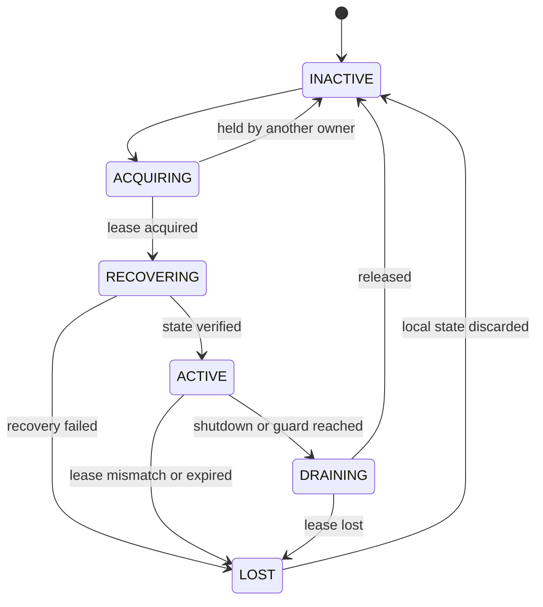

# ADR-V3-004 — Match Runtime lease i fencing enforcement

Data: 31.08.2026  
Repozytorium: `developergracz/gracz-pl-2`  
Ścieżka docelowa: `Nowa dokumentacja Gracz.pl/09-DECYZJE-ARCHITEKTONICZNE/ADR-V3-004-MATCH-RUNTIME-LEASE-FENCING-ENFORCEMENT.md`  
Priorytet: `P0`  
Status: **ACCEPTED / FINAL / NOT IMPLEMENTED / FREEZE-SAFE**

Review provenance: [`REV-ADR-V3-004-20260831-01`](00-ARCHITECTURE-REVIEW-PROVENANCE-REGISTER.md#5-review-record--adr-v3-004)  
Provenance class: **EXTERNAL_RECORDED / REVIEWER IDENTITY NOT RECORDED IN GIT**

> ADR rozstrzyga sposób egzekwowania wcześniej ustalonego modelu `match_actor_leases` z rosnącym fencing tokenem. Nie wdraża tabel, nie uruchamia Match Runtime, nie zmienia produkcji ani nie udziela zgody implementacyjnej.

## 0. Stan operacyjny

```text
DOCUMENT V3 0.2 = MATERIALIZED / REVIEW PENDING
ADR-V3-004 = ACCEPTED / FINAL
IMPLEMENTATION = NOT AUTHORIZED
DEPLOYMENT = NOT AUTHORIZED
FREEZE = ACTIVE
PRODUCTION / RENDER / SECRETS = UNCHANGED
```

## 1. Decyzja w jednym zdaniu

Dla każdego `match_id` ownership jest utrzymywane w trwałym rekordzie `match_actor_leases`, każde przejęcie nadaje rosnący `fencing_token`, aktualny token jest atomowo odzwierciedlany w `game_matches.last_fencing_token`, a każda transakcja mutująca mecz musi równocześnie potwierdzić aktywny lease, ownera, token oraz `expected_version`.

## 2. Kontekst

Gracz.pl V3 wymaga jednego skutecznego writera dla każdego meczu. Samo przypisanie `match_id -> proces` w pamięci nie chroni przed:

- restartem procesu,
- opóźnionym procesem, który odzyskuje połączenie,
- chwilowym podziałem sieci,
- równoległym uruchomieniem dwóch instancji,
- wygaśnięciem lease podczas wykonywania komendy,
- przejęciem meczu przez nową instancję,
- stale snapshotem lub command retry,
- split-brain, w którym stary i nowy aktor uważają się za właściciela.

PostgreSQL V3 ustalił już:

- tabelę `match_actor_leases`,
- ownership per `match_id`,
- rosnący `fencing_token`,
- CAS przez `game_matches.version`,
- transactional outbox,
- idempotency komend,
- invariant: stary writer nie może zatwierdzić zapisu po przejęciu ownershipu.

Otwarte pozostawało dokładne egzekwowanie tokenu. Ten ADR zamyka ten wariant projektowo.

## 3. Źródła normatywne

- `01-ARCHITEKTURA/02-ARCHITEKTURA-DOCELOWA-BACKEND-V3.md`,
- `01-ARCHITEKTURA/03-SKONSOLIDOWANA-ARCHITEKTURA-SYSTEMOWA-GRACZ-PL-V3.md`,
- `02-BAZA-DANYCH/13-POSTGRESQL-V3-ITERACJA-2-GAME-PLATFORM-OUTBOX-IDEMPOTENCY.md`,
- `02-BAZA-DANYCH/20-POSTGRESQL-V3-FINAL.md`,
- `03-MIGRACJA/13-WRITER-READER-INVENTORY.md`,
- `03-MIGRACJA/14-WORKER-EVENT-REALTIME-INVENTORY.md`.

Jeżeli przyszły DDL różni się od tego ADR, migracja nie może być wykonana do czasu usunięcia sprzeczności.

## 4. Siły i wymagania

Decyzja musi jednocześnie zapewnić:

1. jednego skutecznego writera na mecz,
2. brak zależności od zegara aplikacji przy ocenie lease,
3. brak zaufania do tokenu przekazanego przez klienta,
4. ochronę po wygaśnięciu lease nawet przed formalnym takeover,
5. ochronę starego writera po takeover,
6. CAS stanu meczu,
7. idempotentny retry,
8. atomowy state + event + outbox + idempotency result,
9. deterministyczne błędy,
10. odtwarzanie po awarii bez utraty kanonicznego stanu,
11. możliwość obsługi wielu meczów przez jedną instancję,
12. mierzalność i testowalność split-brain.

## 5. Rozważone warianty

### 5.1. Tylko pamięć procesu

**Odrzucone.**

Nie działa po restarcie, nie skaluje się poziomo i nie chroni przed split-brain.

### 5.2. PostgreSQL advisory lock bez fencing tokenu

**Odrzucone jako jedyny mechanizm.**

Lock zależny od sesji może zostać utracony przy zerwaniu połączenia, nie tworzy trwałej generacji ownershipu i nie daje wystarczającego dowodu dla opóźnionego writera.

### 5.3. Token wyłącznie w `match_actor_leases`

**Niewystarczające samodzielnie.**

Wymaga poprawnego dołączenia/lockowania lease przy każdym zapisie. Błąd w pojedynczym writer path mógłby ominąć fencing.

### 5.4. Token wyłącznie w `game_matches`

**Niewystarczające samodzielnie.**

Chroni po takeover, ale bez potwierdzenia `lease_expires_at` może pozwolić staremu ownerowi pisać po wygaśnięciu lease, zanim inna instancja wykona takeover.

### 5.5. Lease row + mirrored token + transakcyjna walidacja

**Wybrane.**

Łączy:

- trwały lifecycle ownershipu,
- rosnącą generację fencing,
- łatwy warunek CAS na agregacie,
- ochronę po expiry,
- ochronę po takeover,
- możliwość audytu i metryk.

## 6. Model danych — decyzja

### 6.1. `match_actor_leases`

Zachowujemy model:

```sql
match_id           UUID PRIMARY KEY
owner_instance_id  VARCHAR(128) NOT NULL
fencing_token      BIGINT NOT NULL CHECK (fencing_token >= 1)
lease_expires_at   TIMESTAMPTZ NOT NULL
acquired_at        TIMESTAMPTZ NOT NULL
renewed_at         TIMESTAMPTZ NOT NULL
```

Dodajemy projektowo:

```sql
released_at        TIMESTAMPTZ NULL
```

Znaczenie:

- `released_at IS NULL` — generation nie została jawnie zwolniona,
- `released_at IS NOT NULL` — generation zakończona; następne acquire zwiększa token,
- wiersz lease nie jest usuwany podczas zwykłego release,
- zachowanie wiersza gwarantuje monotoniczność następnego tokenu.

### 6.2. `game_matches.last_fencing_token`

Dodajemy projektowo:

```sql
last_fencing_token BIGINT NOT NULL DEFAULT 0
CHECK (last_fencing_token >= 0)
```

Wartość `0` oznacza, że mecz nie posiadał jeszcze aktywnej generation Match Runtime. Pierwsze acquire nadaje token `1`.

### 6.3. Brak `lease_id` w zewnętrznym kontrakcie

Nie dodajemy obowiązkowego `lease_id` do publicznego API. `fencing_token` jest trwałym identyfikatorem generation per `match_id`. Jeśli implementacja doda techniczny UUID dla trace/debug, pozostaje on wewnętrzny i nie jest źródłem autoryzacji.

## 7. Źródło czasu i parametry lease

### 7.1. Źródło czasu

Jedynym autorytatywnym zegarem dla acquire, renew, expiry i release jest zegar PostgreSQL:

```sql
clock_timestamp()
```

Zegar procesu aplikacji służy wyłącznie do lokalnego planowania heartbeat i telemetry. Nie rozstrzyga ważności lease.

### 7.2. Wartości początkowe

```text
LEASE_TTL = 15 s
RENEW_INTERVAL = 5 s
MIN_REMAINING_FOR_COMMAND = 5 s
MAX_COMMAND_TRANSACTION = 3 s
RECOVERY_JITTER = 0–2 s
```

Warunki konfiguracyjne:

- `LEASE_TTL >= 3 * RENEW_INTERVAL`,
- `MIN_REMAINING_FOR_COMMAND > MAX_COMMAND_TRANSACTION`,
- każda wartość jest non-secret config,
- production startup failuje przy niespełnieniu relacji,
- zmiana wartości wymaga testów opóźnień, failover i pauz runtime.

Wartości są decyzją startową V3, nie dowodem, że aktualny plan providera spełnia wymagane latency.

## 8. Tożsamość instancji

`owner_instance_id`:

- jest generowany przy każdym starcie procesu Match Runtime,
- jest unikalny dla procesu/generation uruchomienia,
- nie jest ponownie używany po restarcie,
- nie zawiera sekretu ani danych osobowych,
- jest obecny w logach i metrykach w formie bezpiecznej,
- jedna instancja może posiadać wiele meczów.

Zakazana jest unikalność globalna `UNIQUE(owner_instance_id)` w tabeli lease.

## 9. Stan aktora



Tylko `ACTIVE` może przyjmować nową komendę mutującą. `RECOVERING`, `DRAINING` i `LOST` nie wykonują nowych mutacji.

## 10. Acquire i takeover

### 10.1. Zasady

- acquire jest transakcją PostgreSQL,
- nowy wiersz otrzymuje token `1`,
- takeover jest możliwy tylko po expiry albo jawnym release,
- każde takeover zwiększa token o `1`,
- aktualizacja `game_matches.last_fencing_token` następuje w tej samej transakcji,
- brak wyniku oznacza `LEASE_HELD`, nie sukces,
- nie stosujemy read-then-write bez blokady/warunku.

### 10.2. Pseudokod transakcyjny

```text
BEGIN
  db_now := PostgreSQL clock_timestamp()

  spróbuj INSERT lease(token=1) dla brakującego match_id
  jeżeli konflikt:
    spróbuj atomowego UPDATE istniejącego wiersza
    WHERE released_at IS NOT NULL OR lease_expires_at <= db_now
    SET owner_instance_id = current instance,
        fencing_token = fencing_token + 1,
        acquired_at = db_now,
        renewed_at = db_now,
        lease_expires_at = db_now + TTL,
        released_at = NULL

  jeżeli nie uzyskano generation:
    ROLLBACK -> LEASE_HELD

  UPDATE game_matches
  SET last_fencing_token = acquired token
  WHERE match_id = requested match
    AND last_fencing_token < acquired token

  wymagaj dokładnie jednego game_matches row
COMMIT
```

Jeżeli aktualizacja `game_matches` nie powiedzie się, cała transakcja acquire jest wycofywana.

## 11. Renew

Renew jest pojedynczą warunkową operacją opartą o czas DB:

```text
UPDATE match_actor_leases
SET renewed_at = db_now,
    lease_expires_at = db_now + TTL
WHERE match_id = ?
  AND owner_instance_id = ?
  AND fencing_token = ?
  AND released_at IS NULL
  AND lease_expires_at > db_now
RETURNING lease_expires_at
```

Zasady:

- renew nie zwiększa fencing tokenu,
- lease już wygasły nie może zostać odnowiony tym samym tokenem,
- zero wierszy natychmiast klasyfikuje lokalnego aktora jako `LOST`,
- timeout/niejednoznaczny wynik renew nie pozwala zakładać sukcesu,
- aktor przestaje przyjmować komendy po wejściu w guard window,
- odzyskanie ownershipu po expiry wymaga nowego acquire i nowego tokenu.

## 12. Release i graceful shutdown

Release:

```text
UPDATE match_actor_leases
SET released_at = db_now
WHERE match_id = ?
  AND owner_instance_id = ?
  AND fencing_token = ?
  AND released_at IS NULL
```

Zasady:

- wiersz nie jest usuwany,
- release nie zmniejsza ani nie zeruje tokenu,
- następne acquire zwiększa token,
- release starego ownera nie może zwolnić generation nowego ownera,
- graceful shutdown przechodzi `ACTIVE -> DRAINING`, kończy lub przerywa kontrolowanie in-flight command, wykonuje release, odrzuca lokalny stan i kończy proces,
- przy crash recovery opiera się na expiry, nie na release.

## 13. Kontrakt klient → API

Publiczny command envelope zawiera:

```text
command_id / idempotency_key
command_type
match_id
expected_version
payload
client_issued_at (diagnostic only)
```

Publiczny klient **nie przekazuje i nie kontroluje**:

- `owner_instance_id`,
- `fencing_token`,
- lease deadline,
- technicznego `lease_id`.

Fencing jest mechanizmem zaufanego runtime. Przyjęcie tokenu klienta tworzyłoby możliwość spoofingu i mieszałoby concurrency backendu z protokołem UI.

## 14. Kontrakt API → Match Runtime

Warstwa zaufana przekazuje:

```text
command_id
request_hash
command_type
match_id
expected_version
actor_user_id
correlation_id
causation_id
payload
```

Match Runtime sam przypisuje wewnętrznie:

```text
owner_instance_id
fencing_token
lease_expires_at_from_db
```

Routing do instancji nie jest dowodem ownershipu. Ostateczne prawo zapisu potwierdza PostgreSQL w transakcji mutującej.

## 15. Transakcja komendy

### 15.1. Izolacja i kolejność blokad

Wybór bazowy:

- isolation: `READ COMMITTED`,
- jawne blokady i warunki CAS,
- jedna stała kolejność: idempotency row -> lease row -> `game_matches` row,
- krótka transakcja bez wywołań sieciowych,
- provider i realtime dopiero po COMMIT przez outbox.

### 15.2. Algorytm

```text
BEGIN
  1. reserve/check (context, idempotency_key, request_hash)
  2. jeżeli COMPLETED z tym samym hash -> zwróć zapisany wynik
  3. jeżeli ten sam key z innym hash -> IDEMPOTENCY_CONFLICT
  4. lock lease row
  5. wymagaj owner_instance_id = lokalna instancja
  6. wymagaj fencing_token = lokalny token
  7. wymagaj released_at IS NULL
  8. wymagaj lease_expires_at > db_now
  9. wymagaj remaining lease > command guard
 10. UPDATE game_matches
     WHERE match_id = ?
       AND version = expected_version
       AND last_fencing_token = local fencing token
 11. wymagaj dokładnie jednego zaktualizowanego wiersza
 12. INSERT game_match_events
 13. INSERT outbox_events
 14. complete idempotency result
COMMIT
```

Lease row pozostaje zablokowany do COMMIT. Takeover nie może zmienić generation podczas zatwierdzania komendy.

### 15.3. Warunek zapisu

Wzorzec implementacyjny musi być równoważny logicznie:

```sql
UPDATE game_matches AS gm
SET state = $new_state,
    version = gm.version + 1,
    updated_at = clock_timestamp()
FROM match_actor_leases AS lease
WHERE gm.match_id = $match_id
  AND gm.version = $expected_version
  AND gm.last_fencing_token = $fencing_token
  AND lease.match_id = gm.match_id
  AND lease.owner_instance_id = $owner_instance_id
  AND lease.fencing_token = $fencing_token
  AND lease.released_at IS NULL
  AND lease.lease_expires_at > clock_timestamp() + $min_remaining_interval
RETURNING gm.version;
```

W praktycznej implementacji lease row musi być wcześniej zablokowany `FOR UPDATE` w tej samej transakcji. Samo `EXISTS` bez kontrolowanej kolejności blokad nie jest wystarczającym kontraktem.

## 16. Znaczenie braku zaktualizowanego wiersza

Zero rows z mutacji nie jest sukcesem. Runtime wykonuje kontrolowany odczyt diagnostyczny i klasyfikuje wynik:

| Kod | Znaczenie | Publiczne zachowanie |
|---|---|---|
| `MATCH_VERSION_CONFLICT` | `expected_version` nieaktualne | HTTP 409 + wymagany resync |
| `MATCH_LEASE_NOT_OWNED` | inny owner | routing retry lub HTTP 503 |
| `MATCH_LEASE_EXPIRED` | expiry/release | HTTP 503, retryable |
| `MATCH_FENCE_STALE` | token starszy niż current | lokalny aktor `LOST`, HTTP 503 |
| `IDEMPOTENCY_CONFLICT` | ten sam key, inny request hash | HTTP 409, non-retryable bez nowego key |
| `MATCH_RECOVERY_REQUIRED` | stan lokalny niespójny | HTTP 503 + recovery |
| `MATCH_TEMPORARILY_UNAVAILABLE` | ownership w przejściu | HTTP 503 + bounded retry |

Publiczna odpowiedź nie ujawnia wartości ownera, tokenu ani deadline lease.

## 17. Odczyty i fencing

Fencing nie jest wymagany dla każdego zwykłego, read-only odczytu klienta. Odczyt musi być autoryzowany i może korzystać z kanonicznego stanu lub nazwanej projekcji.

Fencing jest obowiązkowy dla:

- przyjęcia komendy przez aktywnego aktora,
- każdej mutacji `game_matches`,
- dopisania eventu/outboxu stanowiącego skutek komendy,
- generowania ACK sukcesu mutacji,
- operacji recovery, która przechodzi do `ACTIVE`.

Eventy i snapshoty zawierają `aggregate_version`. Klient ignoruje zdarzenie starsze niż jego bieżąca wersja i wykonuje resync po wykryciu luki.

## 18. Snapshot, delta i event history

### 18.1. Źródło prawdy

W pierwszej implementacji V3:

- `game_matches.state` i `version` są bieżącym kanonicznym stanem agregatu,
- `game_match_events` jest trwałą, uporządkowaną historią domenową,
- `game_match_snapshots` jest optymalizacją i punktem kontrolnym,
- snapshot nie konkuruje z `game_matches` jako drugie źródło prawdy,
- pełny event sourcing nie jest wymagany przez ten ADR.

### 18.2. Stale snapshot

- snapshot z wersją większą niż `game_matches.version` jest niespójny i wymaga quarantine/alert,
- snapshot starszy może być użyty tylko z kontrolowanym odtworzeniem brakujących eventów,
- jeżeli event history nie pozwala dojść deterministycznie do current version, runtime używa current aggregate state i raportuje gap,
- recovery nie może obniżyć wersji agregatu.

### 18.3. Stale delta

- delta/command oparty o starszą wersję kończy się `MATCH_VERSION_CONFLICT`,
- runtime nie próbuje automatycznie scalać sprzecznych ruchów,
- klient pobiera kanoniczny snapshot i ponawia intencję tylko wtedy, gdy kontrakt gry na to pozwala.

## 19. Recovery

### 19.1. Recovery po restarcie lub takeover

```text
1. wygeneruj nowe owner_instance_id dla procesu
2. acquire/takeover lease
3. atomowo ustaw last_fencing_token
4. przejdź do RECOVERING
5. odczytaj game_matches state/version/rules_version
6. sprawdź ciągłość event sequence i najnowszy poprawny snapshot
7. zbuduj lokalny engine state
8. porównaj wersję lokalną z kanoniczną
9. uruchom heartbeat
10. przejdź do ACTIVE
```

Do czasu kroku 10 nowe komendy są odrzucane albo buforowane wyłącznie w warstwie posiadającej bezpieczny bounded retry. Bufor procesu nie może być jedynym miejscem utrwalenia komendy.

### 19.2. Recovery po utracie lease

- aktor natychmiast przechodzi do `LOST`,
- przestaje przyjmować i zatwierdzać nowe komendy,
- usuwa lokalny stan po zakończeniu diagnostyki,
- nie próbuje odnowić starego tokenu po expiry,
- może ponownie wejść przez pełne acquire, które nada nowy token,
- odpowiedź sukcesu jest dozwolona tylko dla transakcji faktycznie zatwierdzonej.

### 19.3. Recovery idempotency

Klient ponawia tę samą komendę z tym samym `idempotency_key` i identycznym payloadem. Jeśli wcześniejsza transakcja została zatwierdzona, nowy owner zwraca zapisany wynik. Jeśli została wycofana, komenda może zostać wykonana przez aktualnego ownera.

## 20. Model awarii

| Zdarzenie | Decyzja |
|---|---|
| proces crash | brak release; takeover po expiry nadaje nowy token |
| pojedynczy renew timeout | nie zakładamy sukcesu; ponowna kontrola DB, stop przed guard |
| lease expires bez takeover | stary owner nie może rozpocząć/commitować nowej mutacji |
| takeover | token +1 i mirrored token w `game_matches` w jednym commitcie |
| stary proces wraca | jego token nie pasuje; mutacja zwraca zero rows |
| dwa równoległe acquire | dokładnie jedna transakcja uzyskuje generation |
| renew kontra takeover | warunki expiry i row lock rozstrzygają atomowo |
| DB unavailable | brak mutacji i brak ACK sukcesu |
| command tx przekracza limit | cancel/rollback; brak provider/realtime przed commit |
| snapshot uszkodzony | quarantine/alert; current aggregate pozostaje źródłem prawdy |
| duplicate command | idempotency zwraca poprzedni wynik |
| ten sam key, inny payload | deterministyczny konflikt |
| actor w guard window | nie przyjmuje nowej komendy; renew lub controlled handoff |

## 21. Handoff i drain

Kontrolowany handoff:

1. stary owner przechodzi do `DRAINING`,
2. nie przyjmuje nowych komend,
3. kończy lub wycofuje in-flight transaction,
4. publikuje wyłącznie skutki już zatwierdzone przez outbox,
5. wykonuje warunkowy release,
6. nowy owner wykonuje acquire z tokenem +1,
7. nowy owner wykonuje recovery,
8. routing przełącza się na nowego ownera,
9. klienci wykonują resync przy konflikcie wersji.

Nie ma przekazania lokalnego stanu jako jedynej podstawy kontynuacji. Nowy owner zawsze opiera się na PostgreSQL.

## 22. Routing

Routing `match_id -> instance` jest optymalizacją i może korzystać z shared ephemeral store lub brokera po odrębnym ADR. Nie jest mechanizmem bezpieczeństwa.

Jeśli router wyśle komendę do starego ownera:

- stary owner odrzuca ją lokalnie po wykryciu `LOST`, albo
- PostgreSQL odrzuca mutację przez lease/fencing,
- routing może wykonać jeden bounded retry do aktualnego ownera,
- klient zachowuje ten sam `idempotency_key`.

Nie wykonujemy nieograniczonych retry między instancjami.

## 23. Obserwowalność

### 23.1. Metryki

- `match_lease_acquire_total{result}`,
- `match_lease_acquire_duration_seconds`,
- `match_lease_renew_total{result}`,
- `match_lease_remaining_seconds`,
- `match_lease_takeover_total`,
- `match_lease_release_total{result}`,
- `match_fencing_reject_total{reason}`,
- `match_actor_state_count{state}`,
- `match_actor_recovery_duration_seconds`,
- `match_command_conflict_total{reason}`,
- `match_command_transaction_duration_seconds`.

### 23.2. Logi

Logi zawierają:

- `match_id` w zatwierdzonej formie identyfikatora,
- bezpieczny `owner_instance_id`,
- fencing generation,
- actor state transition,
- correlation/command ID,
- sklasyfikowany wynik.

Logi nie zawierają payloadu prywatnej wiadomości, sekretu, credentiala ani pełnego connection string.

### 23.3. Alerty

Alert wymagany co najmniej dla:

- powtarzających się fence reject,
- dwóch ownerów raportujących `ACTIVE` dla tego samego meczu,
- renew failure spike,
- recovery failure,
- command transaction przekraczających limit,
- rosnącej liczby meczów bez możliwego acquire,
- event/snapshot version gap.

## 24. Bezpieczeństwo

- fencing token nie jest sekretem, ale nie jest częścią publicznego API,
- klient nie może wskazać ownera ani tokenu,
- owner instance ma minimalne uprawnienia DB runtime,
- acquire/renew/release są dostępne wyłącznie Match Runtime,
- zwykłe API nie posiada DDL ani migrator credential,
- logi i telemetry nie ujawniają danych użytkowników ponad wymagany zakres,
- wymuszenie opiera się na PostgreSQL, nie na zaufaniu do procesu.

## 25. Testy obowiązkowe

### 25.1. Concurrency

1. dwa acquire dla nieposiadanego meczu — dokładnie jeden sukces,
2. dwa takeover po expiry — dokładnie jeden nowy owner,
3. renew i takeover na granicy expiry — jeden deterministyczny wynik,
4. dwa command tx z tą samą wersją — dokładnie jeden commit,
5. jeden owner obsługuje wiele meczów — brak sztucznego konfliktu.

### 25.2. Fencing

1. stary token po takeover nie może zmienić `game_matches`,
2. stary token nie może dopisać skutecznego event/outboxu,
3. expired lease bez takeover nie pozwala na nową mutację,
4. forged client token jest ignorowany,
5. release starej generation nie zwalnia nowej generation.

### 25.3. Idempotency

1. ten sam key i hash zwraca ten sam wynik,
2. ten sam key i inny hash daje konflikt,
3. crash przed commit pozwala aktualnemu ownerowi wykonać retry,
4. crash po commit zwraca zapisany wynik bez drugiego efektu.

### 25.4. Recovery

1. restart ownera i takeover z current state,
2. recovery z poprawnego snapshotu i eventów,
3. stale snapshot,
4. brakujący event sequence,
5. niezgodna `rules_version`,
6. przerwane recovery nie przechodzi do `ACTIVE`.

### 25.5. Fault injection

1. utrata połączenia DB podczas renew,
2. opóźnienie procesu dłuższe niż TTL,
3. timeout transakcji komendy,
4. restart między state update a ACK,
5. restart po outbox commit przed publikacją,
6. równoległy handoff i command retry.

## 26. Warunki implementacji

Przed rozpoczęciem implementacji muszą istnieć:

- zatwierdzony ADR,
- finalny DDL delta dla `released_at` i `last_fencing_token`,
- transaction helper wymuszający kolejność blokad,
- centralny command handler bez alternatywnego write path,
- idempotency framework,
- outbox framework,
- test harness dla dwóch instancji runtime,
- metryki i alerty,
- rollback/feature flag dla writer cutover,
- formalna zgoda implementacyjna niezależna od tego dokumentu.

## 27. Rollout

Projektowana kolejność:

1. dodać kolumny/tabelę bez aktywacji writera,
2. wdrożyć read-only observability/preflight,
3. wdrożyć acquire/renew/release za wyłączoną flagą,
4. uruchomić test dwóch instancji poza produkcją,
5. uruchomić shadow validation bez write ownership,
6. przełączyć jedną grę referencyjną w kontrolowanym oknie,
7. obserwować fence rejects, conflicts, recovery i outbox lag,
8. rozszerzać dopiero po spełnieniu kryteriów,
9. zachować rollback do poprzedniego writera zgodnie z planem migracji.

Ten ADR nie wykonuje żadnego z tych kroków.

## 28. Konsekwencje

### 28.1. Korzyści

- twarda ochrona przed stale writer,
- ochrona zarówno po expiry, jak i takeover,
- deterministyczny model błędów,
- niezależność od zegara aplikacji,
- bezpieczny retry,
- możliwość poziomego skalowania Match Runtime,
- pełna obserwowalność generation ownershipu.

### 28.2. Koszty

- dodatkowy write/lock dla lease,
- większa złożoność transaction helpera,
- potrzeba heartbeat i recovery state machine,
- konieczność testów wieloinstancyjnych,
- zależność dostępności aktywnych mutacji od PostgreSQL.

Koszty są akceptowane, ponieważ PostgreSQL jest już durable source of truth i arbitrem commitu V3.

## 29. Elementy świadomie nierozstrzygane

Ten ADR nie wybiera:

- brokera/event bus,
- shared ephemeral store,
- SSE vs WebSocket,
- fizycznego routingu instancji,
- pełnego event sourcingu,
- konkretnego mechanizmu service discovery,
- planu/rozmiaru instancji Render.

Te decyzje nie zmieniają invariantów fencing enforcement.

## 30. Kryteria akceptacji ADR

ADR może otrzymać `ACCEPTED DESIGN`, gdy reviewer potwierdzi:

- zgodność z `match_actor_leases` i PostgreSQL V3,
- jawny wybór mirrored token + aktywny lease check,
- ochronę po expiry i takeover,
- brak tokenu w publicznym API,
- jeden autorytatywny zegar DB,
- zamknięty lifecycle acquire/renew/release/takeover,
- stałą kolejność blokad,
- atomowość state/event/outbox/idempotency,
- recovery bez lokalnego source of truth,
- deterministyczne błędy,
- kompletne testy concurrency i fault injection,
- brak autoryzacji wdrożenia.

## 31. Formalny rekord review i provenance

Review record: [`REV-ADR-V3-004-20260831-01`](00-ARCHITECTURE-REVIEW-PROVENANCE-REGISTER.md#5-review-record--adr-v3-004)  
Data review: `31.08.2026`  
Review type: `EXTERNAL ARCHITECTURE REVIEW`  
Git author: `developergracz`  
Reviewer role: `External Lead Architect reviewer — reported outside Git`  
Reviewer identity in Git: `NOT RECORDED`  
Provenance class: `EXTERNAL_RECORDED / IDENTITY NOT GIT-VERIFIABLE`  
Wynik zapisany: `ACCEPTED / FINAL`  
Zakres: `CORRECT`  
Spójność: `PASS`  
Sprzeczności krytyczne: `0`  
Integracja z V3: `PASS`

Zewnętrzny werdykt przekazany poza Git obejmował:

- zgodność modelu lease z PostgreSQL V3 i skonsolidowaną architekturą V3,
- poprawność rosnącego fencing token i CAS/versioning,
- poprawność kontraktu Match Runtime → API,
- kompletność stale lease, fencing mismatch i recovery,
- zgodność z outbox, idempotencją i snapshotami,
- brak konfliktów z pozostałym rejestrem ADR,
- brak autoryzacji implementacji lub deploymentu.

Git potwierdza autora i commity dokumentu, ale nie potwierdza tożsamości ani organizacyjnej niezależności zewnętrznego reviewera. Status decyzji pozostaje bez zmian; provenance review ma poziom `PARTIAL`.

## 32. Wynik projektowy po formalnym review

```text
ADR-V3-004 DESIGN = COMPLETE
P0 DECISION CONTENT = COMPLETE
FORMAL ACCEPTANCE = COMPLETE
ADR-V3-004 = ACCEPTED / FINAL
IMPLEMENTATION = NOT AUTHORIZED
FREEZE = ACTIVE
PRODUCTION / RENDER / SECRETS = UNCHANGED
```
