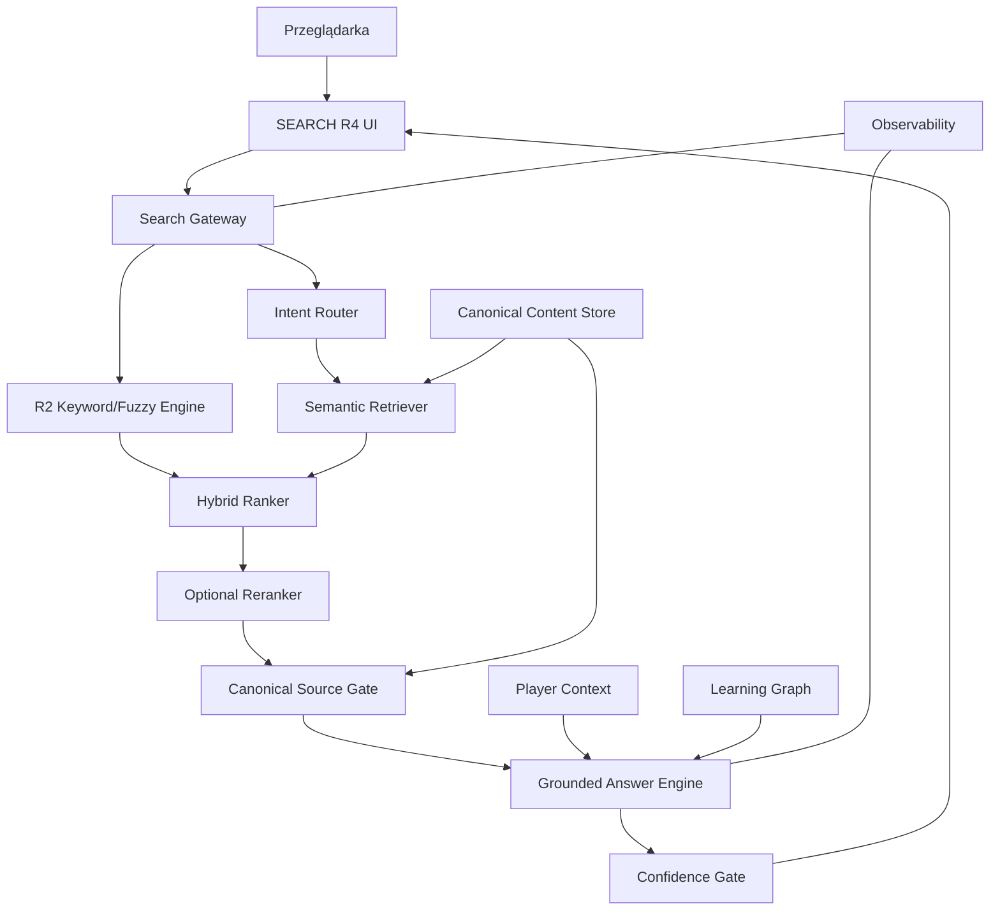

# 01 — Architektura systemowa GRACZ.PL SEARCH R4

Status: **TARGET DESIGN / IMPLEMENTATION NOT STARTED**  
Wersja: 1.0  
Data: 03.10.2026

## 1. Cel

SEARCH R4 ma obsługiwać trzy klasy potrzeb:

- szybkie odnalezienie strony lub sekcji,
- odpowiedź na pytanie naturalnym językiem,
- spersonalizowaną pomoc w nauce i treningu.

System musi działać poprawnie także wtedy, gdy provider AI jest niedostępny.

## 2. Architektura logiczna



## 3. Komponenty

### 3.1. Search UI

Odpowiada za:

- tryby `Szukaj`, `Zapytaj AI`, `Mój trener`,
- historię lokalną,
- źródła,
- CTA do Academy,
- stan fallback,
- dostępność i obsługę klawiatury.

Frontend nie przechowuje sekretów i nie komunikuje się bezpośrednio z providerem modeli.

### 3.2. Search Gateway

Jeden backendowy punkt wejścia dla R4:

- uwierzytelnienie,
- limity,
- correlation ID,
- routing,
- cache,
- walidacja,
- pomiar kosztu,
- provider abstraction.

### 3.3. R2 Core

Istniejący silnik lokalny:

- exact match,
- fuzzy match,
- synonimy,
- filtry,
- deep links,
- sekcje,
- komendy `@poker`, `@zasady` itd.

R2 jest zawsze fallbackiem.

### 3.4. Intent Router

Rozpoznaje klasy intencji:

```text
NAVIGATION
RULES_QUESTION
CONCEPT_EXPLANATION
STRATEGY_EDUCATION
TRAINING_REQUEST
PROGRESS_QUESTION
COMPARE_CONTENT
PORTAL_INFO
LEGAL_INFO
UNSUPPORTED
```

Router może być deterministyczny dla prostych przypadków i modelowy dla niejednoznacznych.

### 3.5. Semantic Retriever

Wyszukuje znaczeniowo w zatwierdzonym korpusie. Nie generuje odpowiedzi. Zwraca kandydatów z:

- `chunk_id`,
- `document_id`,
- `source_class`,
- `game_id`,
- `topic`,
- `canonical_priority`,
- `semantic_score`,
- `keyword_score`,
- `url`,
- `anchor`,
- `content_version`.

### 3.6. Hybrid Ranker

Łączy:

- R2 score,
- semantic score,
- canonical priority,
- source freshness,
- scope gry,
- zgodność intencji,
- opcjonalny kontekst użytkownika.

Przykładowy model logiczny:

```text
final_score =
  0.35 semantic
+ 0.25 keyword
+ 0.20 canonical
+ 0.10 intent
+ 0.05 freshness
+ 0.05 player-context
```

Wagi są konfiguracyjne i podlegają ewaluacji offline.

### 3.7. Reranker

Opcjonalny etap dla top-N. Ma uporządkować wyniki, nie tworzyć treści.

Wymagania:

- wejście tylko top-N,
- twardy timeout,
- cache,
- możliwość wyłączenia,
- brak wpływu na dostępność R2.

### 3.8. Canonical Source Gate

Przed generacją odrzuca sprzeczne lub niezatwierdzone źródła.

Reguła nadrzędna:

```text
CANONICAL_RULES > ACADEMY_CORE > GUIDE_APPROVED > PORTAL_INFO > SUPPORTING_CONTENT
```

Przy wykrytej sprzeczności odpowiedź nie może mieszać obu wersji bez jawnego oznaczenia.

### 3.9. Grounded Answer Engine

Tworzy:

- krótką odpowiedź,
- listę źródeł,
- cytowalne fragmenty,
- suggested actions,
- follow-up questions.

Nie otrzymuje pełnej bazy wiedzy, tylko wybrane i zweryfikowane fragmenty.

### 3.10. Confidence Gate

Przykładowe poziomy:

```text
HIGH        -> pokaż odpowiedź + źródła
MEDIUM      -> pokaż ostrożną odpowiedź + źródła
INSUFFICIENT-> nie generuj odpowiedzi; pokaż wyniki
```

Confidence nie może opierać się wyłącznie na „pewności modelu”. Musi uwzględniać jakość retrieval i zgodność źródeł.

### 3.11. Player Context

Dostępny tylko dla zalogowanego użytkownika i tylko dla „Mój trener”.

Nie jest włączany automatycznie do wszystkich zapytań.

### 3.12. Learning Graph

Graf zależności edukacyjnych:

```text
topic -> prerequisite -> exercise -> quiz -> remediation -> next_topic
```

Przykład:

```text
Poker / Rundy rozdania
  -> Akcje
  -> Pozycje
  -> Pot odds
  -> Trener decyzji
```

## 4. Ścieżki wykonania

### 4.1. Proste wyszukanie

```text
"gomoku"
→ R2
→ wyniki
→ 0 generative AI calls
```

### 4.2. Pytanie o zasady

```text
"czy bicie w warcabach jest obowiązkowe?"
→ intent RULES_QUESTION
→ semantic retrieval
→ canonical rules gate
→ grounded answer
→ źródło /gry/warcaby/zasady/#bicie
```

### 4.3. Mój trener

```text
"co mam dzisiaj ćwiczyć?"
→ auth required
→ player context
→ learning graph
→ rekomendacja
→ konkretna lekcja / quiz / trener
```

## 5. Fallback matrix

| Awaria | Zachowanie |
|---|---|
| Model generatywny timeout | pokaż retrieval + R2 |
| Reranker timeout | użyj hybrid ranking bez rerank |
| Semantic store unavailable | użyj R2 |
| Player Context unavailable | AI bez personalizacji |
| Learning Graph unavailable | źródłowa odpowiedź bez planu |
| Budget hard stop | R2 + komunikat o czasowej niedostępności AI |

## 6. Skalowanie

R4 musi skalować niezależnie:

- statyczny frontend,
- search gateway,
- semantic store,
- inference provider,
- cache,
- worker indeksujący.

Dodanie nowej gry nie może wymagać zmian w kodzie routera poza manifestem i danymi konfiguracyjnymi.

## 7. Niefunkcjonalne wymagania

- brak single point of failure w providerze AI,
- deterministyczny fallback,
- brak klucza API w kliencie,
- source traceability dla każdej odpowiedzi,
- wersjonowanie korpusu,
- możliwość reindex bez przestoju,
- pełna obsługa mobile,
- monitoring kosztu per request,
- możliwość całkowitego wyłączenia AI feature flagą.
